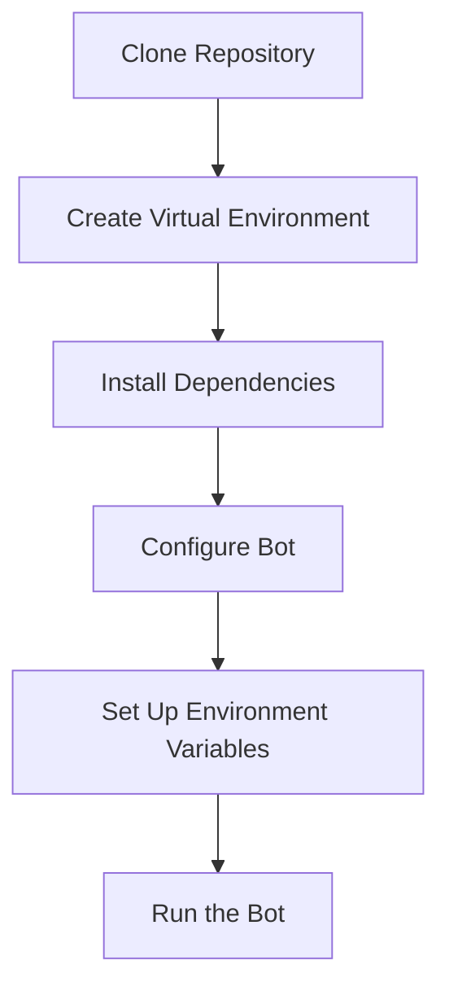

# Configuration and Setup

## Overview

This guide explains how to configure and set up the Zora Portia Trading Bot for optimal performance. The bot offers extensive customization options through configuration files, environment variables, and command-line arguments.

## Installation

### Prerequisites

Before setting up the bot, ensure you have:

- Python 3.8 or higher
- pip package manager
- A Zora Network compatible wallet
- (Optional) Portia AI API key for AI-enhanced trading

### Step-by-Step Installation



1. **Clone the Repository**
   ```bash
   git clone https://github.com/yourusername/zora-portia-bot.git
   cd zora-portia-bot
   ```

2. **Create a Virtual Environment**
   ```bash
   python -m venv .venv
   source .venv/bin/activate  # On Windows: .venv\Scripts\activate
   ```

3. **Install Dependencies**
   ```bash
   pip install -r requirements.txt
   ```

4. **Configure the Bot** (detailed in next section)

5. **Run the Bot**
   ```bash
   python run_bot.py --wallet YOUR_WALLET_ADDRESS
   ```

## Configuration Options

### Configuration File (config.json)

The primary configuration is managed through `config.json`, which controls core bot settings:

```json
{
  "zora": {
    "rpc_url": "https://rpc.zora.energy/",
    "graphql_url": "https://api.zora.co/graphql",
    "ws_url": "wss://rpc.zora.energy"
  },
  "portia": {
    "api_url": "https://api.portia.ai/v1",
    "enabled": true
  },
  "max_coins": 50,
  "scan_interval": 120,
  "logging": {
    "level": "INFO",
    "file": "zora_bot.log",
    "console": true
  },
  "strategies": {
    "simple": {
      "enabled": true,
      "volatility_threshold": 0.03,
      "momentum_threshold": 0.02,
      "volume_threshold": 500,
      "confidence_multiplier": 1.0
    },
    "momentum": {
      "enabled": true,
      "short_period": 12,
      "long_period": 26,
      "signal_period": 9
    }
  },
  "trading": {
    "auto_trading": false,
    "max_trade_amount_usd": 100.0,
    "confidence_threshold": 0.75,
    "max_allocation_percent": 20.0,
    "min_eth_reserve": 0.05,
    "simulated": true,
    "mock_capital": 1000.0,
    "portfolio_update_interval": 60
  }
}
```

### Environment Variables (.env)

Sensitive information should be stored in the `.env` file, which isn't checked into version control:

```
# Zora Network API Configuration
ZORA_RPC_URL=https://rpc.zora.energy/
ZORA_API_KEY=your_optional_api_key

# Portia AI Integration
PORTIA_API_KEY=your_portia_api_key
PORTIA_API_URL=https://api.portia.ai/v1

# Wallet Configuration
WALLET_ADDRESS=0xYourWalletAddress
WALLET_PRIVATE_KEY=your_private_key_for_real_trading

# Additional Settings
LOG_LEVEL=INFO
SIMULATE_TRADING=true
```

### Command Line Arguments

For quick adjustments without modifying configuration files, use command-line arguments:

```bash
# Basic usage
python run_bot.py --wallet 0xYourWalletAddress

# With auto-trading enabled
python run_bot.py --wallet 0xYourWalletAddress --auto-trade

# Simulation with specific parameters
python run_bot.py --wallet 0xYourWalletAddress --mock-capital 5000 --confidence 0.8 --max-trade-amount 50

# Using specific strategies
python run_bot.py --wallet 0xYourWalletAddress --strategies SimpleStrategy,MomentumStrategy
```

## Configuration Hierarchy

The bot follows this priority order for configuration (highest to lowest):

1. Command-line arguments
2. Environment variables
3. Configuration file (config.json)
4. Default values

This allows flexible configuration management for different environments.

## Network Configuration

### RPC Endpoints

The bot requires a reliable RPC endpoint for the Zora Network. Options include:

1. **Public RPC**: `https://rpc.zora.energy/` (may have rate limits)
2. **Infura/Alchemy**: Use a provider-specific URL with your API key
3. **Self-hosted**: Run your own RPC node for maximum reliability

Example Infura configuration:
```
ZORA_RPC_URL=https://zora-mainnet.infura.io/v3/YOUR_INFURA_KEY
```

### WebSocket Configuration

For real-time updates, configure the WebSocket endpoint:

```json
{
  "zora": {
    "ws_url": "wss://rpc.zora.energy"
  }
}
```

## Trading Strategy Configuration

Each strategy can be individually configured with specific parameters:

### SimpleStrategy Configuration

```json
{
  "strategies": {
    "simple": {
      "enabled": true,
      "volatility_threshold": 0.03,
      "momentum_threshold": 0.02,
      "volume_threshold": 500,
      "confidence_multiplier": 1.0
    }
  }
}
```

### MomentumStrategy Configuration

```json
{
  "strategies": {
    "momentum": {
      "enabled": true,
      "short_period": 12,
      "long_period": 26,
      "signal_period": 9,
      "momentum_threshold": 0.02
    }
  }
}
```

## Portia AI Integration

To enable Portia AI integration for enhanced trading signals:

```json
{
  "portia": {
    "enabled": true,
    "api_url": "https://api.portia.ai/v1"
  }
}
```

And in your `.env` file:
```
PORTIA_API_KEY=your_portia_api_key
```

## Logging Configuration

Configure logging behavior for both console and file output:

```json
{
  "logging": {
    "level": "INFO",
    "file": "zora_bot.log",
    "console": true,
    "format": "%(asctime)s - %(name)s - %(levelname)s - %(message)s"
  }
}
```

Available log levels: `DEBUG`, `INFO`, `WARNING`, `ERROR`, `CRITICAL`

## Environment-Specific Configuration

### Development Environment

```json
{
  "trading": {
    "simulated": true,
    "mock_capital": 1000.0
  },
  "logging": {
    "level": "DEBUG"
  }
}
```

### Production Environment

```json
{
  "trading": {
    "simulated": false,
    "auto_trading": true,
    "max_trade_amount_usd": 50.0,
    "confidence_threshold": 0.85
  },
  "logging": {
    "level": "INFO"
  }
}
```

## Advanced Configuration

### Custom Token Lists

You can configure the bot to track specific tokens:

```json
{
  "tokens": {
    "custom_list": [
      {
        "address": "0x7ce9c67c8a1d65ce61fc464727cc0f9caabf92b9",
        "symbol": "ZORA",
        "name": "Zora Protocol Token"
      },
      {
        "address": "0x4200000000000000000000000000000000000006",
        "symbol": "WETH",
        "name": "Wrapped Ethereum"
      }
    ]
  }
}
```

### Risk Management Settings

Configure risk management parameters:

```json
{
  "risk_management": {
    "max_portfolio_allocation": 20.0,
    "stop_loss_percent": 15.0,
    "take_profit_percent": 50.0,
    "emergency_stop_threshold": 30.0
  }
}
```

### Performance Monitoring

Enable performance tracking:

```json
{
  "performance": {
    "tracking_enabled": true,
    "metrics_interval": 3600,
    "save_history": true,
    "history_file": "performance_history.json"
  }
}
```

## Security Best Practices

1. **Never commit `.env` files** to version control
2. **Use environment variables** for sensitive information
3. **Start with simulation mode** before enabling real trading
4. **Limit trade sizes** with `max_trade_amount_usd`
5. **Keep private keys secure** and never share them

## Troubleshooting

### Common Issues

1. **Connection Problems**
   - Check RPC URL configuration
   - Verify network connectivity
   - Try an alternative RPC provider

2. **API Rate Limiting**
   - Increase `scan_interval` to reduce API calls
   - Use a dedicated API key
   - Implement exponential backoff (already built-in)

3. **Trading Issues**
   - Verify wallet has sufficient funds
   - Check confidence threshold settings
   - Review log files for error messages

### Checking Logs

Review the log file for detailed information:

```bash
tail -f zora_bot.log
```

Look for error messages or warnings that might indicate configuration issues.

## Configuration Examples

### Minimal Configuration

```json
{
  "zora": {
    "rpc_url": "https://rpc.zora.energy/"
  },
  "trading": {
    "simulated": true
  }
}
```

### Complete Production Configuration

```json
{
  "zora": {
    "rpc_url": "https://zora-mainnet.infura.io/v3/YOUR_INFURA_KEY",
    "graphql_url": "https://api.zora.co/graphql",
    "ws_url": "wss://zora-mainnet.infura.io/ws/v3/YOUR_INFURA_KEY"
  },
  "portia": {
    "api_url": "https://api.portia.ai/v1",
    "enabled": true
  },
  "max_coins": 50,
  "scan_interval": 60,
  "logging": {
    "level": "INFO",
    "file": "zora_bot.log",
    "console": true
  },
  "strategies": {
    "simple": {
      "enabled": true,
      "volatility_threshold": 0.04,
      "momentum_threshold": 0.03,
      "volume_threshold": 1000,
      "confidence_multiplier": 1.2
    },
    "momentum": {
      "enabled": true,
      "short_period": 10,
      "long_period": 30,
      "signal_period": 7
    }
  },
  "trading": {
    "auto_trading": true,
    "max_trade_amount_usd": 50.0,
    "confidence_threshold": 0.85,
    "max_allocation_percent": 15.0,
    "min_eth_reserve": 0.1,
    "simulated": false,
    "portfolio_update_interval": 30
  },
  "risk_management": {
    "max_portfolio_allocation": 15.0,
    "stop_loss_percent": 10.0,
    "take_profit_percent": 40.0,
    "emergency_stop_threshold": 25.0
  }
}
```

## Next Steps

After configuring the bot:

1. Run in simulation mode first to verify configuration
2. Monitor performance and adjust parameters as needed
3. Enable auto-trading with small amounts initially
4. Gradually increase trading amounts as you gain confidence
5. Regularly back up your configuration and performance data
