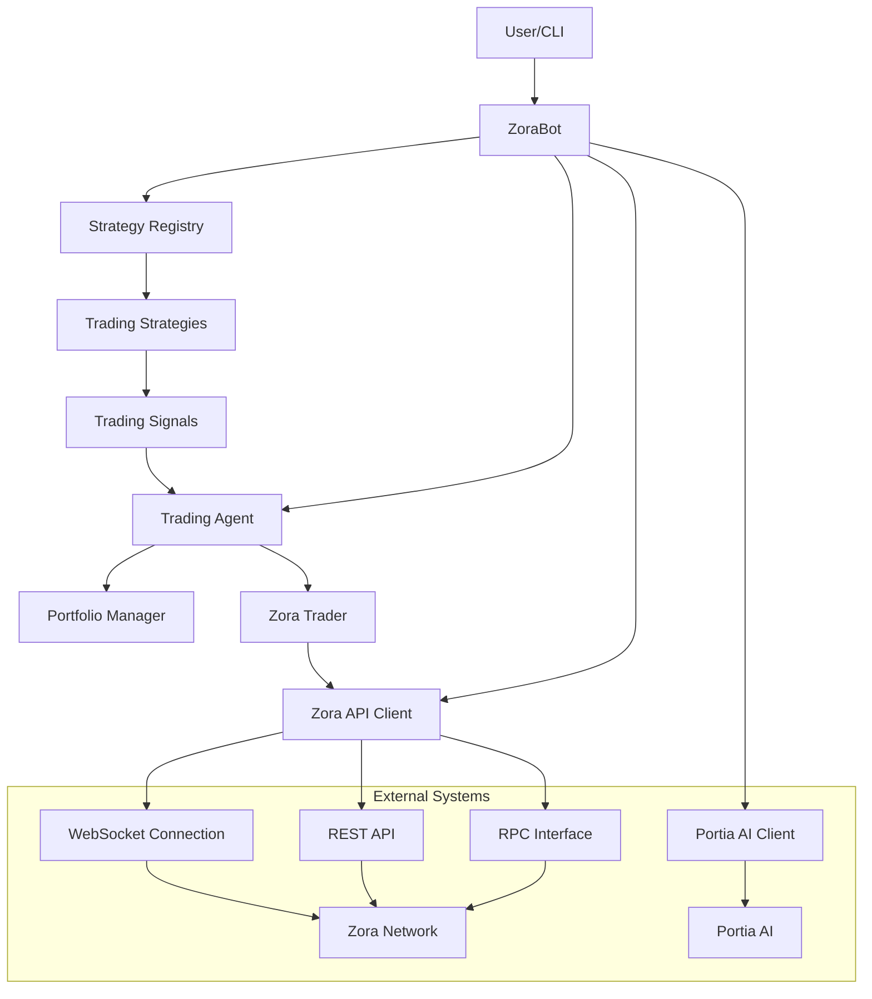

# Zora Portia Trading Bot Documentation

## Overview

Welcome to the comprehensive documentation for the Zora Portia Trading Bot. This documentation covers all aspects of the bot, from installation and configuration to advanced usage and customization.

The Zora Portia Trading Bot is an automated cryptocurrency trading system designed for the Zora Network. It features AI integration through Portia, multiple trading strategies, and both simulated and real trading capabilities.

## Table of Contents

### Getting Started
- [[zora_portia_bot|Introduction and Overview]]
- [[installation_continued|Installation and Getting Started]]
- [[configuration_setup|Configuration and Setup]]

### Core Components
- [[system_architecture|System Architecture]]
- [[trading_agent|Trading Agent]]
- [[zora_api_client|Zora API Client]]
- [[trading_strategies_continued|Trading Strategies]]
- [[portfolio_management|Portfolio Management]]
- [[trading_signals|Trading Signals System]]
- [[portia_ai_integration|Portia AI Integration]]

## Quick Start Guide

1. **Installation**: [[installation_continued#Installation Steps|Install the bot]] by following the step-by-step guide
2. **Configuration**: [[configuration_setup#Configuration Options|Configure the bot]] using the provided templates
3. **First Run**: Start with [[installation_continued#First Run|simulation mode]] to familiarize yourself with the bot
4. **Strategy Selection**: Choose from [[trading_strategies_continued#Strategy Types|available strategies]] or create your own
5. **Portfolio Setup**: Configure [[portfolio_management|portfolio management]] for optimal asset allocation
6. **Trading**: Enable [[trading_agent#Signal Evaluation Process|auto-trading]] when ready

## System Architecture



## Key Features

### Multi-Strategy Trading

The bot supports multiple trading strategies that can be used simultaneously:

- **[[trading_strategies_continued#SimpleStrategy|SimpleStrategy]]**: Basic momentum and volatility-based strategy
- **MomentumStrategy**: Focuses on price momentum and trend following
- **VolatilityStrategy**: Capitalizes on market volatility

### AI-Enhanced Trading

Integration with [[portia_ai_integration|Portia AI]] provides:

- Advanced market analysis
- Enhanced trading signals
- Sentiment analysis
- Price predictions
- Risk assessment

### Portfolio Management

The [[portfolio_management|portfolio management system]] offers:

- Real-time portfolio tracking
- Performance metrics
- Asset allocation
- Risk management
- Visualization tools

### Flexible Configuration

The bot features extensive [[configuration_setup|configuration options]]:

- Command-line arguments for quick adjustments
- Environment variables for sensitive information
- Configuration file for persistent settings
- Strategy-specific parameter tuning

### Simulation Mode

Test strategies without risking real funds:

- Simulated trading with mock capital
- Realistic price movements
- Performance tracking
- Strategy effectiveness evaluation

### Real-Time Data

Access to real-time market data through:

- WebSocket connections for instant updates
- REST API for detailed information
- RPC calls for blockchain interaction

### Extensibility

The bot is designed for easy extension:

- Modular architecture
- Plugin system for strategies
- Customizable components
- Developer-friendly codebase

## Usage Examples

### Basic Usage

Run the bot with default settings:

```bash
python run_bot.py --wallet YOUR_WALLET_ADDRESS
```

### Auto-Trading Mode

Enable automated trading with specific parameters:

```bash
python run_bot.py --wallet YOUR_WALLET_ADDRESS --auto-trade --confidence 0.8 --max-trade-amount 50
```

### Multiple Strategies

Combine multiple trading strategies:

```bash
python run_bot.py --wallet YOUR_WALLET_ADDRESS --strategies SimpleStrategy,MomentumStrategy
```

### AI-Enhanced Trading

Leverage Portia AI for improved trading decisions:

```bash
python run_bot.py --wallet YOUR_WALLET_ADDRESS --auto-trade --portia-enabled
```

## Common Workflows

### Setting Up a New Bot

1. [[installation_continued#Installation Steps|Install the bot]]
2. [[configuration_setup#Configuration File (config.json)|Configure settings]]
3. [[installation_continued#First Run|Run in simulation mode]]
4. [[trading_strategies_continued#Strategy Types|Select appropriate strategies]]
5. [[portfolio_management#Risk Management|Configure risk management]]
6. [[installation_continued#Running in Auto-Trading Mode|Enable auto-trading]]

### Developing Custom Strategies

1. [[trading_strategies_continued#Custom Strategy Development|Create a new strategy class]]
2. [[trading_strategies_continued#Strategy Interface|Implement the strategy interface]]
3. [[trading_strategies_continued#Strategy Registry|Register in the strategy registry]]
4. [[trading_strategies_continued#Strategy Performance Metrics|Test the strategy in simulation]]
5. [[trading_strategies_continued#Strategy Optimization|Optimize strategy parameters]]

### Managing Portfolios

1. [[portfolio_management#Portfolio Tracking|Set up portfolio tracking]]
2. [[portfolio_management#Asset Allocation|Configure asset allocation]]
3. [[portfolio_management#Risk Management|Set up risk management rules]]
4. [[portfolio_management#Performance Tracking|Monitor performance metrics]]
5. [[portfolio_management#Portfolio Analysis Tools|Analyze portfolio effectiveness]]

## Best Practices

### Security

- Never commit private keys or API keys to version control
- Use environment variables for sensitive information
- Start with simulation mode before real trading
- Limit trade sizes, especially for new strategies
- Regularly back up configuration and data

### Performance

- Monitor strategy performance over time
- Adjust parameters based on market conditions
- Use multiple strategies for diversification
- Start with conservative confidence thresholds
- Gradually increase trading amounts as strategies prove effective

### Monitoring

- Regularly check logs for errors or warnings
- Monitor portfolio performance metrics
- Track trade success rates by strategy
- Set up alerts for significant events
- Periodically review and optimize strategies

## Advanced Topics

### Custom Strategy Development

Create your own trading strategies by implementing the strategy interface:

```python
class MyCustomStrategy:
    """
    Custom trading strategy implementation
    """
    
    def __init__(self, my_param: float = 0.05):
        self.my_param = my_param
        
    async def generate_signals(self, coins: list[Coin]) -> list[Signal]:
        """Generate trading signals based on custom logic"""
        signals = []
        
        for coin in coins:
            # Implement custom signal logic here
            if custom_condition:
                signals.append(Signal(
                    type=SignalType.BUY,
                    coin=coin,
                    strength=0.75,
                    reason="Custom buy condition met",
                    strategy="MyCustomStrategy"
                ))
            
        return signals
```

### AI Model Integration

Leverage Portia AI for advanced trading insights:

```python
# Get AI analysis for a specific token
ai_analysis = await portia_client.get_token_sentiment("0x7ce9c67c8a1d65ce61fc464727cc0f9caabf92b9")

# Use AI insights to adjust trading decisions
if ai_analysis and ai_analysis.get("sentiment_score", 0) > 0.7:
    # Strong positive sentiment from AI
    signal.strength *= 1.2  # Boost signal strength
```

### Multi-Chain Support

The bot architecture supports extension to multiple blockchains:

```python
# Initialize clients for different chains
zora_client = ZoraClient(rpc_url="https://rpc.zora.energy/")
base_client = BaseClient(rpc_url="https://mainnet.base.org")

# Track portfolio across chains
zora_holdings = await zora_client.get_user_holdings(wallet_address)
base_holdings = await base_client.get_user_holdings(wallet_address)

# Combine portfolio data
all_holdings = {**zora_holdings, **base_holdings}
```

## Troubleshooting

For common issues and their solutions, check the troubleshooting guides:

- [[installation_continued#Common First-Run Issues|Installation Issues]]
- [[configuration_setup#Troubleshooting|Configuration Problems]]
- [[trading_agent#Error Handling|Trading Errors]]
- [[zora_api_client#Rate Limiting Handling|API and Rate Limiting Issues]]

## Contributing

The Zora Portia Trading Bot is an open-source project, and contributions are welcome. To contribute:

1. Fork the repository
2. Create a feature branch
3. Implement your changes
4. Add tests for new functionality
5. Submit a pull request

## Resources

### API Documentation

- [Zora Network API](https://docs.zora.co/docs/api/intro)
- [Portia AI API](https://docs.portia.ai/)
- [Web3.py Documentation](https://web3py.readthedocs.io/)

### Community

- [Zora Discord](https://discord.gg/zora)
- [Trading Bot Discussion Forum](https://forum.zora.co/c/trading-bots)
- [Developer Community](https://github.com/zora-bots/community)

## Glossary

| Term | Definition |
|------|------------|
| Zora Network | A specialized blockchain network for NFTs and cryptocurrency trading |
| Portia AI | Artificial intelligence platform for crypto trading analysis |
| Signal | Trading recommendation (BUY/SELL/HOLD) generated by strategies |
| Strategy | Algorithm for analyzing market data and generating signals |
| Portfolio | Collection of cryptocurrency holdings and their metrics |
| Confidence Threshold | Minimum signal strength required for trade execution |
| Mock Capital | Simulated money used for testing trading strategies |
| WebSocket | Protocol for real-time data communication |
| RPC | Remote Procedure Call interface for blockchain interaction |

## Changelog

### v0.1.0 (Initial Release)

- Basic trading functionality
- Simple momentum strategy
- Portfolio tracking
- Simulation mode

### v0.2.0

- Added multiple trading strategies
- Improved portfolio management
- Enhanced configuration options
- Real trading capabilities

### v0.3.0 (Current)

- Portia AI integration
- Advanced signal processing
- Multi-strategy support
- Improved visualization and logging
- Enhanced error handling

## Roadmap

Upcoming features and improvements:

1. **Web Dashboard**: Visual interface for monitoring and control
2. **Advanced Analytics**: Enhanced performance metrics and visualizations
3. **Machine Learning Models**: Custom ML models for trading decisions
4. **Multi-Chain Support**: Trading across multiple blockchains
5. **Social Integration**: Notifications via messaging platforms

## Disclaimer

Trading cryptocurrency involves significant risk. The Zora Portia Trading Bot is provided for educational and research purposes only. Always use caution when trading and never risk more than you can afford to lose. Past performance does not guarantee future results.