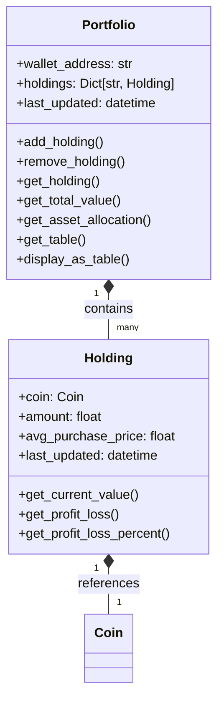
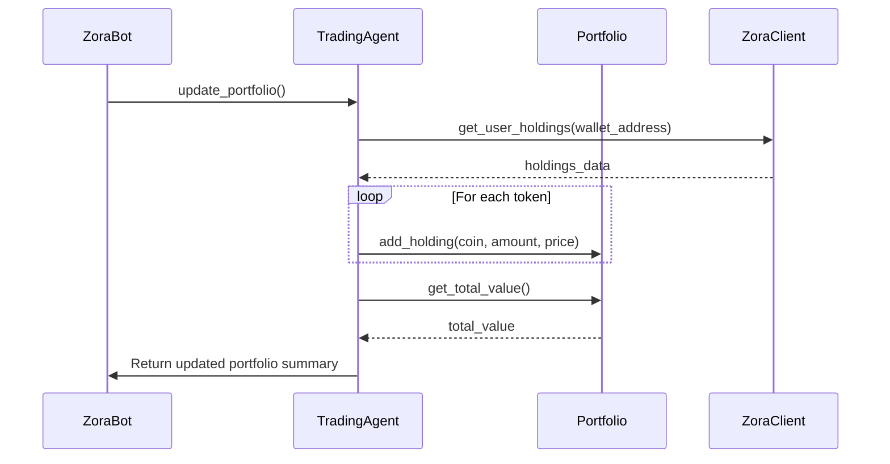
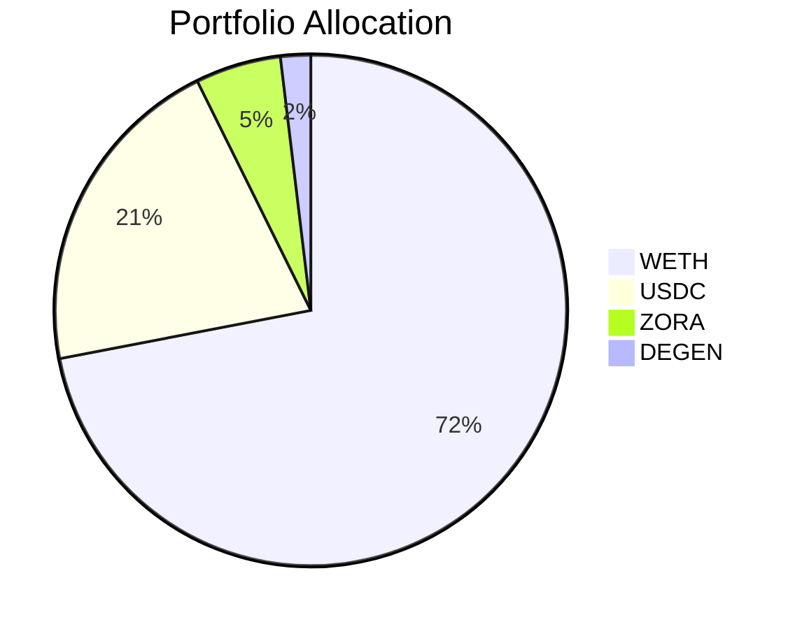
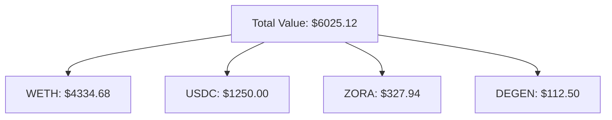

# Portfolio Management

## Overview

The Portfolio Management component of the Zora Portia Trading Bot handles tracking, valuation, and management of the user's crypto assets. It provides a comprehensive view of holdings, calculates performance metrics, and enables the trading agent to make informed decisions.

## Core Components

### Portfolio Class

The `Portfolio` class is the central component that tracks all holdings:



## Key Features

### Portfolio Tracking

The portfolio tracks all token holdings with detailed information:

```python
# Add a holding to the portfolio
portfolio.add_holding(
    coin=coin,
    amount=3.75,
    avg_purchase_price=75.20
)

# Remove (sell) tokens from a holding
portfolio.remove_holding(
    coin=coin,
    amount=1.5,
    sale_price=87.45
)
```

### Portfolio Valuation

The portfolio provides various valuation metrics:

```python
# Get total portfolio value
total_value = portfolio.get_total_value()

# Get value of a specific holding
zora_value = portfolio.get_holding("0x7ce9...").get_current_value()

# Get profit/loss for a specific holding
zora_pl = portfolio.get_holding("0x7ce9...").get_profit_loss()
zora_pl_pct = portfolio.get_holding("0x7ce9...").get_profit_loss_percent()
```

### Portfolio Visualization

The portfolio can be displayed as a formatted table:

```
💼 PORTFOLIO FOR 0x1234...5678

┌──────────────┬─────────┬──────────┬──────────┬───────────┐
│ Token        │ Amount  │ Price    │ Value    │ Change    │
├──────────────┼─────────┼──────────┼──────────┼───────────┤
│ ZORA         │ 3.75    │ $87.45   │ $327.94  │ +16.3%    │
│ WETH         │ 1.12    │ $3870.25 │ $4334.68 │ +12.2%    │
│ DEGEN        │ 450.0   │ $0.25    │ $112.50  │ +25.0%    │
│ USDC         │ 1250.0  │ $1.00    │ $1250.00 │ +0.0%     │
├──────────────┼─────────┼──────────┼──────────┼───────────┤
│ TOTAL        │         │          │ $6025.12 │ +15.8%    │
└──────────────┴─────────┴──────────┴──────────┴───────────┘
```

## Portfolio Update Process

The portfolio is regularly updated with the latest market data:



## Asset Allocation

The portfolio tracks asset allocation to ensure diversification:

```python
# Get current asset allocation
allocation = portfolio.get_asset_allocation()
# Returns: {"ZORA": 5.4%, "WETH": 71.9%, "DEGEN": 1.9%, "USDC": 20.7%}
```

This helps the trading agent avoid overconcentration in any single asset.

## Performance Tracking

The portfolio tracks performance metrics over time:

```python
# Get overall portfolio performance
portfolio_performance = {
    "total_value": portfolio.get_total_value(),
    "total_cost": portfolio.get_total_cost(),
    "total_profit_loss": portfolio.get_total_profit_loss(),
    "total_profit_loss_percent": portfolio.get_total_profit_loss_percent(),
    "best_performing": portfolio.get_best_performing(),
    "worst_performing": portfolio.get_worst_performing()
}
```

## Trading History

The portfolio maintains a record of all trades:

```python
# Record of past trades
trading_history = [
    {
        "timestamp": "2025-04-10T14:23:45",
        "type": "BUY",
        "coin": "ZORA",
        "amount": 3.75,
        "price": 75.20,
        "value": 282.00,
        "simulated": True
    },
    {
        "timestamp": "2025-04-11T09:15:20",
        "type": "SELL",
        "coin": "DEGEN",
        "amount": 150.0,
        "price": 0.28,
        "value": 42.00,
        "simulated": True
    }
]
```

## Portfolio Management Best Practices

### 1. Risk Management

The bot implements several risk management features:

- **Maximum Allocation**: Limits the percentage of portfolio in a single asset
- **Position Sizing**: Calculates appropriate position sizes based on portfolio value
- **Stop-Loss**: Can implement automatic stop-loss selling to limit downside

```python
# Check if adding this position would exceed max allocation
new_position_value = amount * price
portfolio_value = portfolio.get_total_value()
allocation_percent = (new_position_value / portfolio_value) * 100

if allocation_percent > max_allocation_percent:
    # Reduce position size to meet max allocation constraint
    adjusted_amount = (max_allocation_percent * portfolio_value) / (100 * price)
```

### 2. Rebalancing

The portfolio can be rebalanced to maintain target allocations:

```python
# Target allocations
target_allocations = {
    "ZORA": 10.0,   # 10%
    "WETH": 60.0,   # 60%
    "DEGEN": 5.0,   # 5%
    "USDC": 25.0    # 25%
}

# Calculate rebalancing trades
rebalancing_trades = portfolio.calculate_rebalancing_trades(target_allocations)
```

### 3. Emergency Stop

The portfolio implements an emergency stop feature if certain conditions are met:

- Total portfolio value drops below a threshold
- Single asset loses more than a defined percentage
- Market volatility exceeds safe levels

```python
# Check for emergency stop conditions
portfolio_value = portfolio.get_total_value()
if portfolio_value < emergency_threshold:
    # Trigger emergency stop
    await trading_agent.disable_auto_trading()
    await trading_agent.liquidate_risky_assets()
```

## Portfolio Analysis Tools

The portfolio provides various analysis tools:

### Historical Performance

```python
# Get historical portfolio values
historical_values = portfolio.get_historical_values()

# Calculate returns
daily_returns = portfolio.calculate_returns("daily")
monthly_returns = portfolio.calculate_returns("monthly")
```

### Risk Metrics

```python
# Calculate portfolio volatility
volatility = portfolio.calculate_volatility()

# Calculate Sharpe ratio
sharpe_ratio = portfolio.calculate_sharpe_ratio()

# Calculate maximum drawdown
max_drawdown = portfolio.calculate_max_drawdown()
```

## Simulated vs. Real Portfolio

The bot can maintain both simulated and real portfolios:

### Simulated Portfolio

- Uses mock capital
- Executes trades without affecting real assets
- Useful for strategy testing
- Can start with demo data

```python
# Initialize with demo portfolio
trading_agent.use_demo_portfolio()
```

### Real Portfolio

- Reflects actual on-chain holdings
- Updated via blockchain queries
- Used for real trading decisions
- Requires wallet connection

```python
# Update with real blockchain data
await trading_agent.update_portfolio()
```

## Integration with Trading Agent

The portfolio is tightly integrated with the trading agent:

```python
# Trading agent uses portfolio for decisions
holding = agent.portfolio.get_holding(coin.address)
if holding and holding.amount > 0:
    # We own this token, consider selling
    if signal.type == SignalType.SELL and signal.strength > agent.confidence_threshold:
        sell_amount = holding.amount * 0.5  # Sell half
        trade_decisions.append({
            "coin": coin,
            "type": "SELL",
            "amount": sell_amount,
            "price": coin.current_price
        })
```

## Data Visualization

The portfolio data can be visualized using various charts:





## Future Enhancements

Planned enhancements to the portfolio management system:

1. **Tax Reporting**: Generate tax reports for cryptocurrency trades
2. **Advanced Analytics**: Implement more sophisticated performance metrics
3. **Portfolio Optimization**: Automatically suggest optimal asset allocation
4. **DeFi Integration**: Track DeFi positions like staking and liquidity providing
5. **Multi-Chain Support**: Extend portfolio tracking to multiple blockchains
