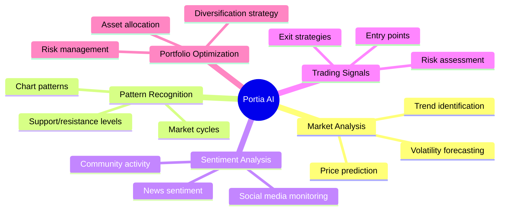
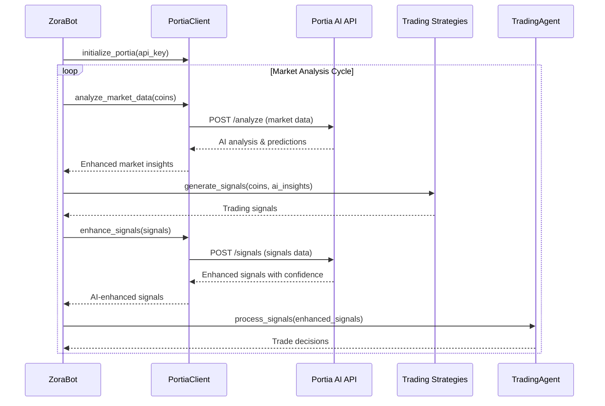
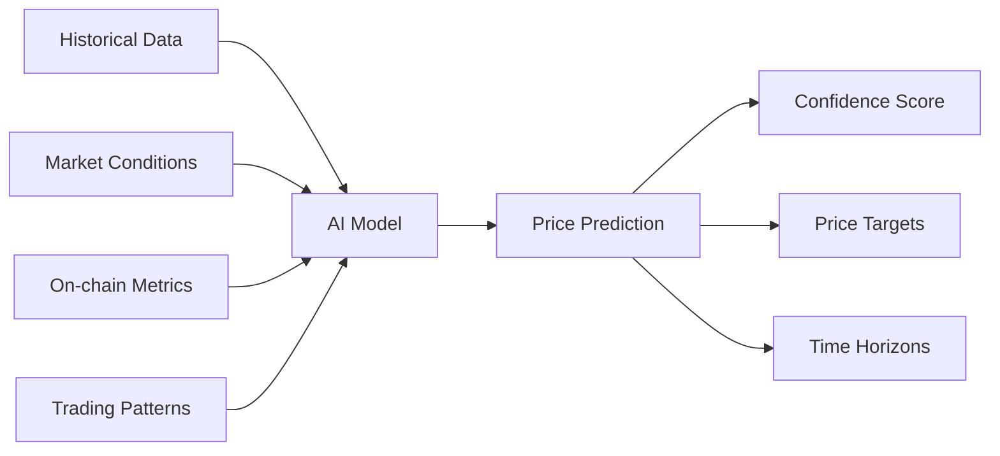
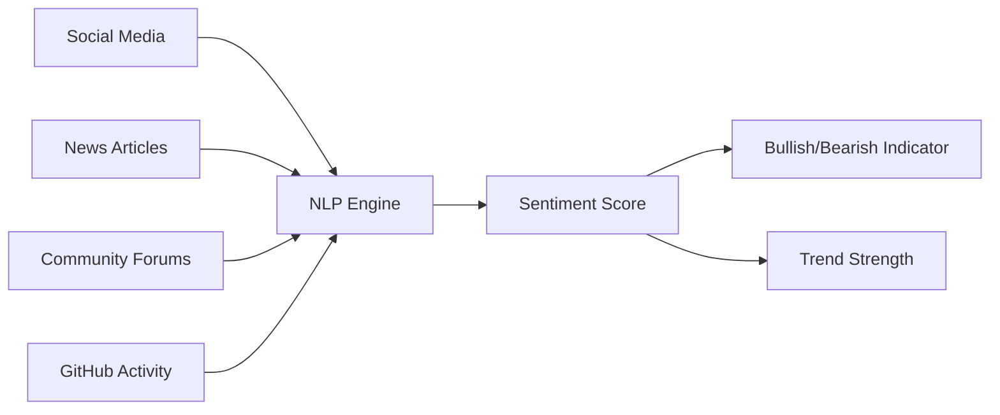
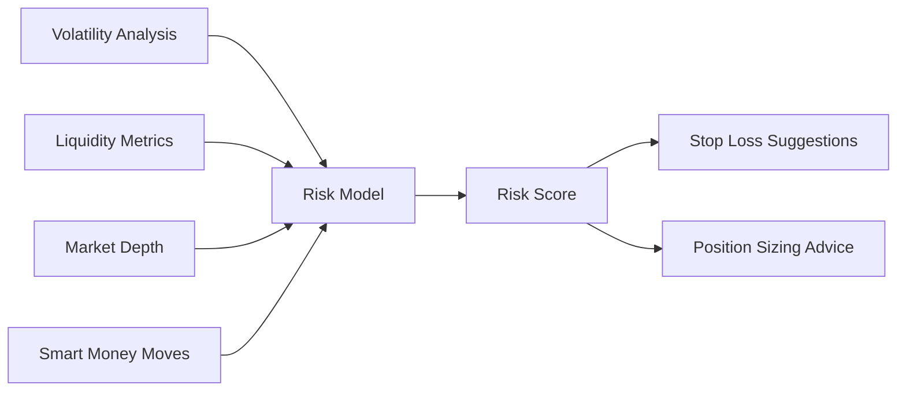

# Portia AI Integration

## Overview

The Zora Portia Trading Bot features integration with Portia AI, a specialized artificial intelligence platform for cryptocurrency trading. This integration enhances the bot's trading capabilities by leveraging AI-powered market analysis, pattern recognition, and predictive models.

## Portia AI Capabilities



## Integration Architecture

The Portia AI integration is implemented through the `PortiaClient` class, which communicates with the Portia AI API. This client is used by the ZoraBot to enhance trading signals and decision-making.



## Portia Client Implementation

The `PortiaClient` class provides a simple interface for interacting with the Portia AI API:

```python
class PortiaClient:
    """
    Client for interacting with Portia AI API
    """
    
    def __init__(
        self,
        api_key: str,
        api_url: str = "https://api.portia.ai/v1"
    ):
        self.api_key = api_key
        self.api_url = api_url
        self.headers = {
            "Content-Type": "application/json",
            "X-API-Key": api_key
        }
        self.session = None
        
    async def initialize(self):
        """Initialize the API client session"""
        self.session = aiohttp.ClientSession(headers=self.headers)
        
    async def close(self):
        """Close the API client session"""
        if self.session:
            await self.session.close()
            
    async def analyze_market_data(self, market_data: Dict[str, Any]) -> Dict[str, Any]:
        """
        Send market data to Portia AI for analysis
        
        Args:
            market_data: Market data including tokens, prices, volumes, etc.
            
        Returns:
            AI analysis results
        """
        endpoint = f"{self.api_url}/analyze"
        
        try:
            async with self.session.post(endpoint, json=market_data) as response:
                if response.status == 200:
                    return await response.json()
                else:
                    logger.error(f"Portia AI API error: {response.status}")
                    return {}
        except Exception as e:
            logger.error(f"Error calling Portia AI: {e}")
            return {}
            
    async def enhance_signals(self, signals: List[Dict[str, Any]]) -> List[Dict[str, Any]]:
        """
        Enhance trading signals with AI insights
        
        Args:
            signals: List of trading signals
            
        Returns:
            Enhanced signals with AI confidence scores
        """
        endpoint = f"{self.api_url}/enhance_signals"
        
        try:
            async with self.session.post(endpoint, json={"signals": signals}) as response:
                if response.status == 200:
                    result = await response.json()
                    return result.get("enhanced_signals", signals)
                else:
                    logger.error(f"Portia AI API error: {response.status}")
                    return signals
        except Exception as e:
            logger.error(f"Error enhancing signals with Portia AI: {e}")
            return signals
            
    async def get_token_sentiment(self, token_address: str) -> Dict[str, Any]:
        """
        Get AI-powered sentiment analysis for a specific token
        
        Args:
            token_address: The token contract address
            
        Returns:
            Sentiment analysis data
        """
        endpoint = f"{self.api_url}/token_sentiment"
        
        try:
            async with self.session.get(
                endpoint, 
                params={"token_address": token_address}
            ) as response:
                if response.status == 200:
                    return await response.json()
                else:
                    logger.error(f"Portia AI API error: {response.status}")
                    return {}
        except Exception as e:
            logger.error(f"Error getting token sentiment: {e}")
            return {}
```

## Enhanced Trading Signals

When Portia AI integration is enabled, trading signals are enhanced with additional data:

### Standard Signal
```json
{
  "type": "BUY",
  "coin": {
    "address": "0x7ce9c67c8a1d65ce61fc464727cc0f9caabf92b9",
    "symbol": "ZORA",
    "name": "Zora Token",
    "current_price": 87.45,
    "price_change_24h": 15.4
  },
  "strength": 0.72,
  "reason": "Strong momentum with 15.4% gain",
  "strategy": "SimpleStrategy"
}
```

### AI-Enhanced Signal
```json
{
  "type": "BUY",
  "coin": {
    "address": "0x7ce9c67c8a1d65ce61fc464727cc0f9caabf92b9",
    "symbol": "ZORA",
    "name": "Zora Token",
    "current_price": 87.45,
    "price_change_24h": 15.4
  },
  "strength": 0.85,  // Enhanced confidence
  "reason": "Strong momentum with 15.4% gain",
  "strategy": "SimpleStrategy",
  "ai_enhancements": {
    "sentiment_score": 0.82,
    "community_activity": "high",
    "technical_outlook": "bullish",
    "price_target": 98.50,
    "stop_loss_suggestion": 78.70,
    "momentum_score": 0.79,
    "volatility_forecast": "increasing",
    "market_cycle_position": "early_uptrend",
    "confidence_adjustment": 0.13  // How much AI enhanced the signal
  }
}
```

## Configuration

To enable Portia AI integration, update your config.json file:

```json
{
  "portia": {
    "enabled": true,
    "api_url": "https://api.portia.ai/v1",
    "confidence_boost": 0.1,  // How much to boost signals based on AI
    "min_confidence": 0.7,    // Minimum confidence for AI-enhanced signals
    "features": {
      "sentiment_analysis": true,
      "price_prediction": true,
      "risk_assessment": true,
      "portfolio_optimization": false
    }
  }
}
```

And add your API key to your .env file:

```
PORTIA_API_KEY=your_portia_api_key_here
```

## Bot Integration

The ZoraBot integrates with Portia AI in several key workflows:

### Market Analysis

```python
# If Portia AI is enabled, enhance market data analysis
if self.portia_client and self.portia_enabled:
    # Prepare market data for AI analysis
    market_data = {
        "tokens": [coin.to_dict() for coin in coins],
        "market_stats": {
            "total_volume": sum(coin.volume_24h for coin in coins if hasattr(coin, 'volume_24h')),
            "timestamp": datetime.now().isoformat()
        }
    }
    
    # Get AI analysis
    ai_analysis = await self.portia_client.analyze_market_data(market_data)
    
    # Enhance coins with AI insights
    if ai_analysis and "token_insights" in ai_analysis:
        for insight in ai_analysis["token_insights"]:
            address = insight.get("address")
            if address in self.coins_by_address:
                coin = self.coins_by_address[address]
                coin.ai_sentiment = insight.get("sentiment_score", 0.5)
                coin.ai_price_prediction = insight.get("price_prediction")
                coin.ai_risk_level = insight.get("risk_level", "medium")
```

### Signal Enhancement

```python
# If Portia AI is enabled, enhance the trading signals
if self.portia_client and self.portia_enabled:
    # Convert signals to format for API
    signals_data = [
        {
            "type": signal.type.value,
            "coin_address": signal.coin.address,
            "coin_symbol": signal.coin.symbol,
            "strength": signal.strength,
            "reason": signal.reason,
            "strategy": signal.strategy
        }
        for signal in signals
    ]
    
    # Get enhanced signals
    enhanced_signals_data = await self.portia_client.enhance_signals(signals_data)
    
    # Update signals with AI enhancements
    if enhanced_signals_data:
        for i, enhanced in enumerate(enhanced_signals_data):
            if i < len(signals):
                signals[i].strength = enhanced.get("strength", signals[i].strength)
                signals[i].ai_enhancements = enhanced.get("ai_enhancements", {})
                
                # Add AI reasoning to original reason
                ai_reason = enhanced.get("ai_reason")
                if ai_reason:
                    signals[i].reason += f" | AI: {ai_reason}"
```

## Portia AI Features

### Price Prediction

Portia AI analyzes historical price data and market conditions to predict future price movements.



### Sentiment Analysis

Portia AI analyzes social media, news, and community activity to gauge market sentiment.



### Risk Assessment

Portia AI evaluates the risk profile of tokens and trading decisions.



## Performance Metrics

The bot tracks the performance of AI-enhanced signals compared to standard signals:

```
📊 AI PERFORMANCE METRICS

Time Period: Last 7 days
Total Signals: 124
AI-Enhanced Signals: 78
Standard Signals: 46

Win Rate (AI): 68.2%
Win Rate (Standard): 52.1%
Improvement: +16.1%

Average Return (AI): 12.4%
Average Return (Standard): 8.7%
Improvement: +3.7%

PnL (AI): +$427.82
PnL (Standard): +$215.46
```

## Usage Examples

### Basic Integration

```python
# Initialize Portia client
portia_client = PortiaClient(
    api_key=os.environ.get("PORTIA_API_KEY"),
    api_url=os.environ.get("PORTIA_API_URL", "https://api.portia.ai/v1")
)

# Initialize in bot
bot = ZoraBot(
    portia_client=portia_client,
    portia_enabled=True
)
```

### Only Using Sentiment Analysis

```python
# Configure to only use sentiment analysis
config = {
    "portia": {
        "enabled": True,
        "features": {
            "sentiment_analysis": True,
            "price_prediction": False,
            "risk_assessment": False,
            "portfolio_optimization": False
        }
    }
}

# Create bot with this configuration
bot = ZoraBot(config=config)
```

### AI-Based Strategy

```python
class PortiaStrategy:
    """
    Strategy that relies primarily on Portia AI signals
    """
    
    def __init__(self, portia_client):
        self.portia_client = portia_client
        
    async def generate_signals(self, coins):
        signals = []
        
        # Get AI analysis for all coins
        coin_data = [coin.to_dict() for coin in coins]
        ai_analysis = await self.portia_client.analyze_market_data({"tokens": coin_data})
        
        if not ai_analysis or "token_insights" not in ai_analysis:
            return []
            
        # Generate signals based on AI insights
        for insight in ai_analysis["token_insights"]:
            address = insight.get("address")
            
            # Find matching coin
            coin = next((c for c in coins if c.address == address), None)
            if not coin:
                continue
                
            # Get AI recommendation
            recommendation = insight.get("recommendation", "HOLD")
            confidence = insight.get("confidence", 0.5)
            
            # Only generate signals with sufficient confidence
            if confidence >= 0.7:
                signal_type = SignalType.HOLD
                
                if recommendation == "BUY":
                    signal_type = SignalType.BUY
                elif recommendation == "SELL":
                    signal_type = SignalType.SELL
                    
                signals.append(Signal(
                    type=signal_type,
                    coin=coin,
                    strength=confidence,
                    reason=insight.get("reasoning", "AI recommendation"),
                    strategy="PortiaStrategy"
                ))
                
        return signals
```

## Future Enhancements

Planned enhancements for the Portia AI integration include:

1. **Custom Model Training**: Train AI models on user-specific trading history
2. **Automated Strategy Optimization**: Let AI fine-tune strategy parameters
3. **News Analysis**: Incorporate real-time news and events into trading decisions
4. **Multi-Chain Intelligence**: Analyze data across multiple blockchains
5. **Voice Assistants**: Provide spoken AI insights and recommendations

## API Documentation

For detailed Portia AI API documentation, visit:
https://docs.portia.ai/

## Fallback Mechanisms

If the Portia AI API is unavailable or the integration is disabled, the bot will fall back to standard trading strategies without AI enhancement:

```python
# Try to get AI enhancements but fall back gracefully
try:
    if self.portia_client and self.portia_enabled:
        # Enhanced signals with AI
        enhanced_signals = await self.portia_client.enhance_signals(signals_data)
        return enhanced_signals
    else:
        # Standard signals without AI
        return signals
except Exception as e:
    logger.error(f"Error enhancing signals with Portia AI: {e}")
    # Fall back to standard signals
    return signals
```

This ensures the bot continues to function even without AI capabilities.
