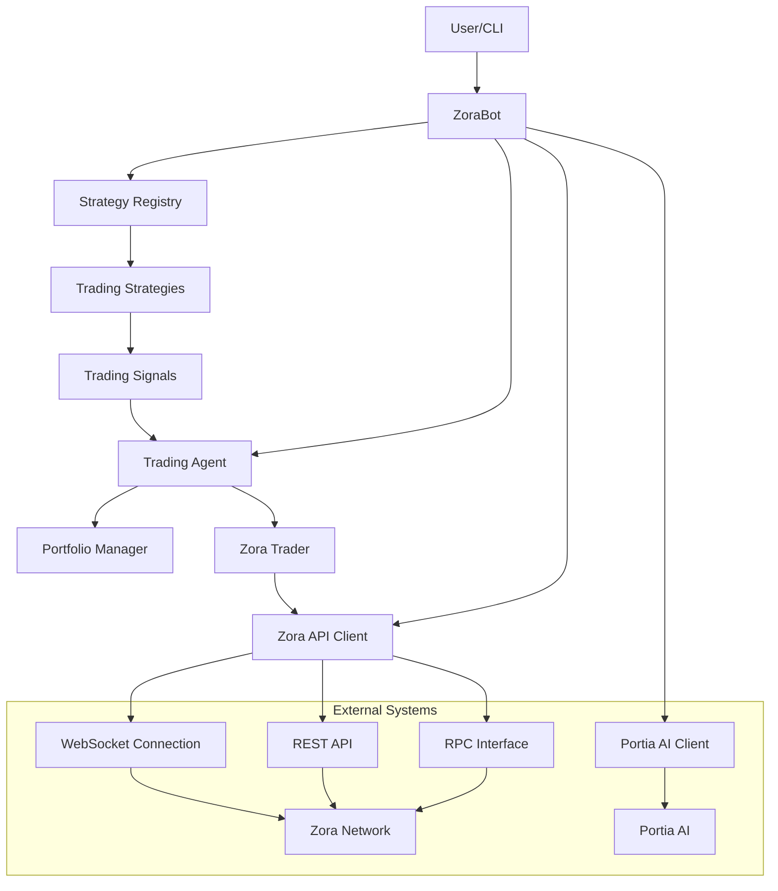
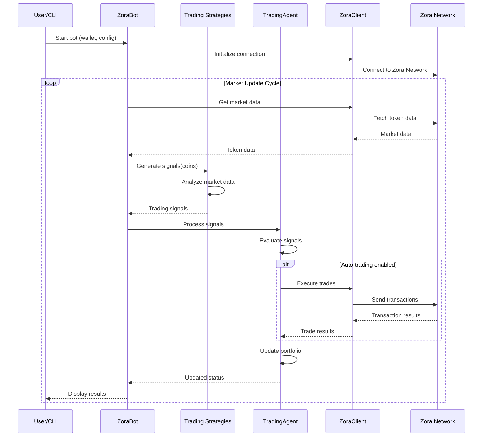
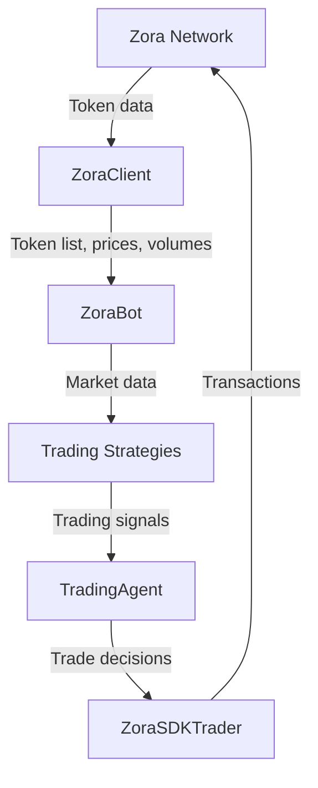
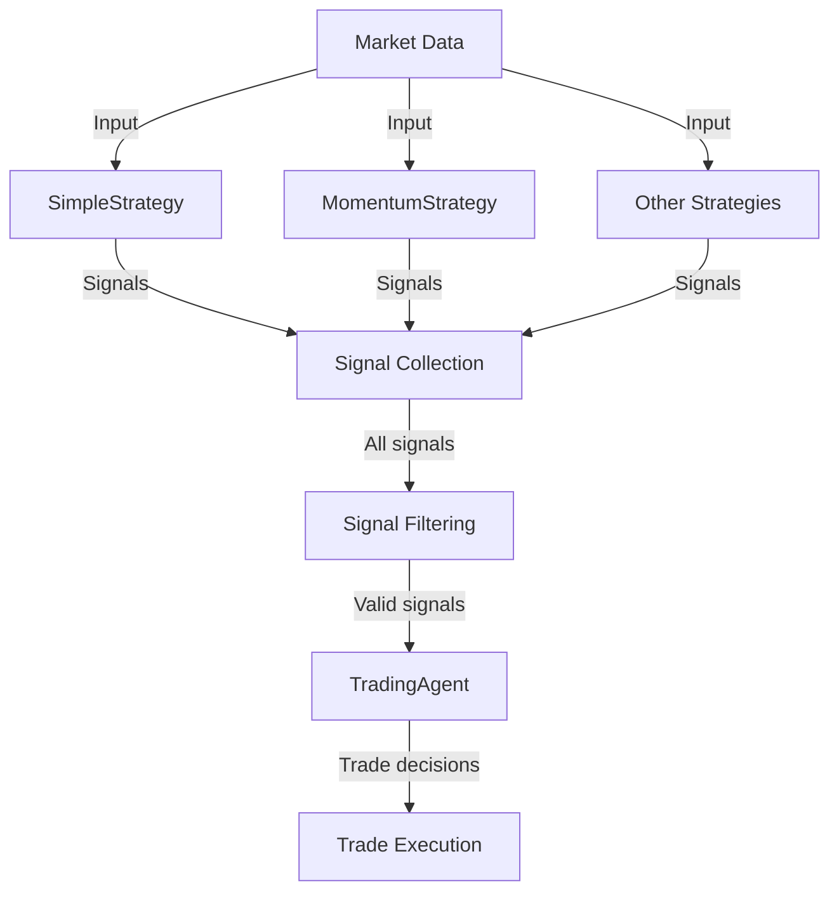
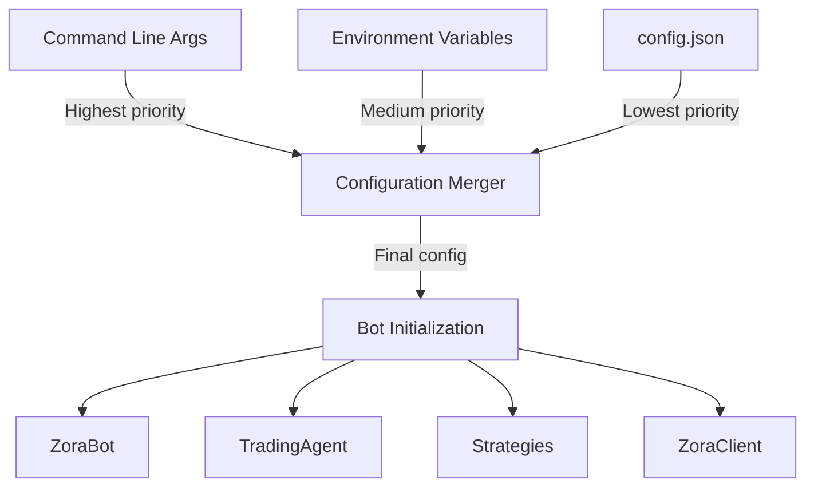
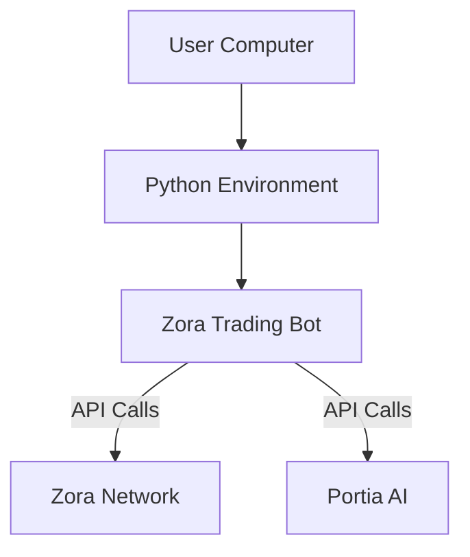
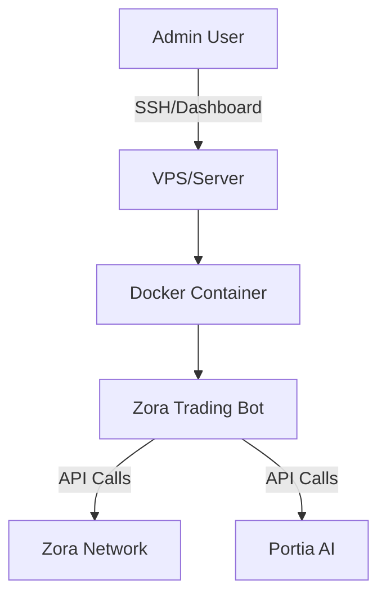
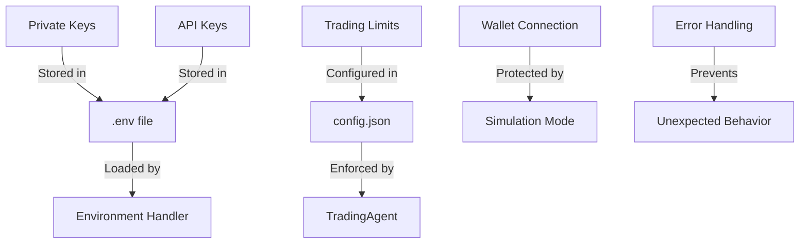
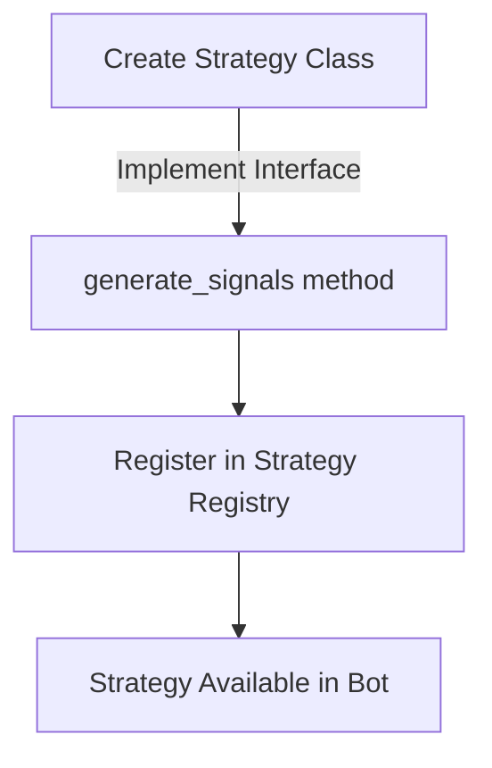
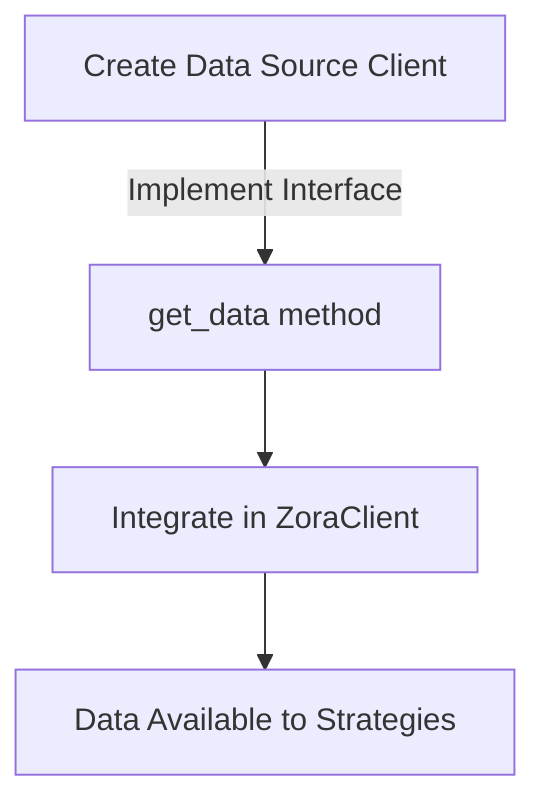

# System Architecture

## Overview

The Zora Portia Trading Bot is designed with a modular, extensible architecture that separates concerns and allows for flexible component integration. This document outlines the system architecture, component interactions, and data flow within the bot.

## High-Level Architecture

## Component Interactions

### Core Components Workflow

## Component Descriptions

### 1. ZoraBot (Main Controller)

The `ZoraBot` class serves as the main controller for the trading bot, orchestrating all components and managing the event loop.

**Responsibilities:**
- Initialize all components based on configuration
- Manage the main update loop
- Process market data and generate signals
- Execute trades based on signals
- Handle WebSocket connections for real-time data
- Update the portfolio and track performance

### 2. ZoraClient (API Client)

The `ZoraClient` class handles all communication with the Zora Network through various interfaces.

**Responsibilities:**
- Connect to Zora Network via RPC
- Fetch market data for tokens
- Get user portfolio/holdings information
- Execute trades on the blockchain
- Maintain WebSocket connections for real-time data
- Handle API rate limiting and retries

### 3. TradingAgent (Decision Maker)

The `TradingAgent` class evaluates signals and executes trades.

**Responsibilities:**
- Evaluate trading signals from strategies
- Make trade decisions based on signal strength
- Execute trades through the Zora client
- Manage the user's portfolio
- Track trading history and performance
- Implement risk management policies

### 4. Portfolio (Asset Tracker)

The `Portfolio` class tracks all user holdings and calculates performance metrics.

**Responsibilities:**
- Track all token holdings and balances
- Calculate portfolio value and performance
- Generate portfolio tables and visualizations
- Track profit/loss for individual assets
- Manage asset allocation and rebalancing

### 5. Trading Strategies

Various strategy classes that analyze market data and generate trading signals.

**Responsibilities:**
- Analyze token price, volume, and other metrics
- Generate BUY/SELL/HOLD signals with confidence levels
- Provide reasoning for trading decisions
- Adapt to changing market conditions
- Simulate price movements for testing

### 6. ZoraSDKTrader (Execution Engine)

The `ZoraSDKTrader` class handles the technical aspects of trade execution.

**Responsibilities:**
- Convert trading decisions to transactions
- Handle token approvals and allowances
- Execute swaps through Zora's exchange
- Handle slippage and gas optimization
- Track transaction status and confirmations

### 7. Portia Client (AI Integration)

The `PortiaClient` class integrates with Portia AI for enhanced signals.

**Responsibilities:**
- Send market data to Portia AI API
- Receive AI-enhanced trading recommendations
- Adjust signal confidence based on AI input
- Track AI performance metrics
- Handle API authentication and rate limiting

## Data Flow

### Market Data Flow

### Signal Generation Flow

### Configuration Flow

## Technology Stack

The Zora Portia Trading Bot is built using the following technologies:

- **Python 3.8+**: Core programming language
- **asyncio**: Asynchronous I/O, event loop, and concurrency
- **aiohttp**: Asynchronous HTTP client/server
- **websockets**: WebSocket client implementation
- **Web3.py**: Ethereum/Zora blockchain interaction
- **pandas**: Data analysis and manipulation
- **numpy**: Numerical computing
- **pydantic**: Data validation and settings management

## Deployment Architecture

The bot can be deployed in various environments:

### Local Deployment

### Server Deployment

## Security Architecture

The bot implements several security measures:

## Extensibility

The bot is designed to be easily extended with new components:

### Adding New Strategies

### Adding New Data Sources

## Performance Considerations

The architecture addresses performance through several mechanisms:

- **Asynchronous Processing**: Using asyncio for non-blocking operations
- **Connection Pooling**: Reusing connections to minimize overhead
- **Rate Limiting**: Implementing backoff strategies for API calls
- **Data Caching**: Minimizing redundant data fetches
- **Efficient Data Structures**: Using optimized data structures for market data

## Future Architecture Extensions

The architecture can be extended in several ways:

1. **Microservices Architecture**: Split components into separate services
2. **Event-Driven Architecture**: Use message queues for component communication
3. **Multi-Strategy Optimization**: Implement meta-strategies that optimize strategy combinations
4. **Multi-Chain Support**: Extend to support multiple blockchains
5. **Web Interface**: Add a web dashboard for monitoring and control

## System Requirements

- **CPU**: Dual-core processor (minimum), Quad-core recommended
- **RAM**: 2GB minimum, 4GB recommended
- **Disk Space**: 1GB for installation and logs
- **Network**: Stable internet connection
- **Operating System**: Linux, macOS, or Windows with Python support
