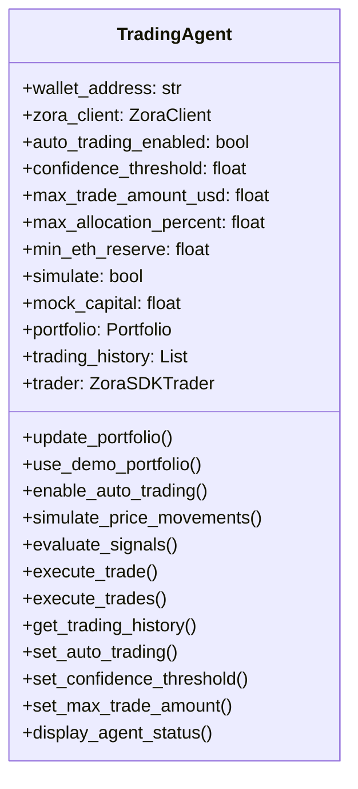
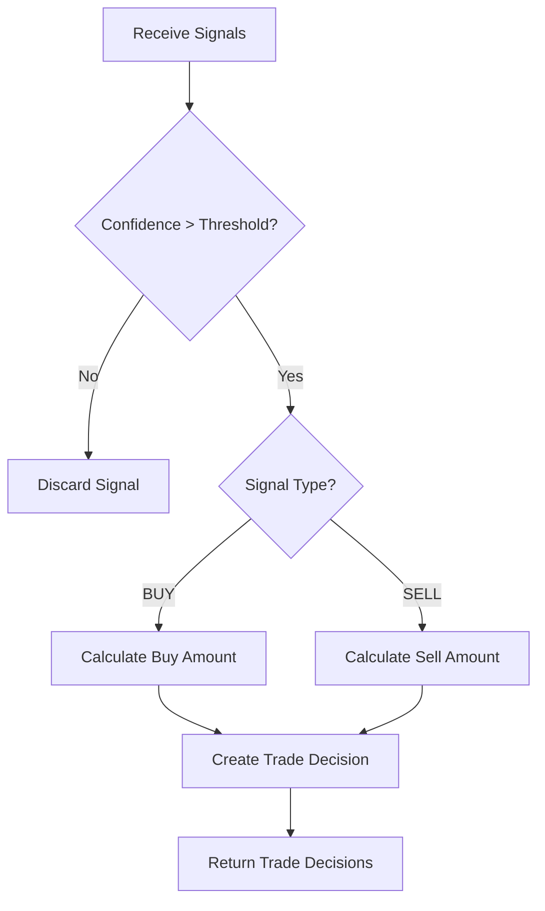

# Trading Agent

## Overview

The `TradingAgent` is a core component of the Zora Portia Trading Bot that handles signal evaluation and trade execution. It acts as the decision-making unit that determines when to buy or sell tokens based on signals generated by trading strategies.

## Class Details



## Key Responsibilities

1. **Signal Evaluation**: Processes trading signals from strategies and decides which trades to execute
2. **Trade Execution**: Executes buy/sell orders on the Zora Network 
3. **Portfolio Management**: Tracks and updates the user's token holdings
4. **Simulated Trading**: Manages mock trading with simulated capital
5. **Performance Tracking**: Records trading history and calculates performance metrics

## Configuration Parameters

| Parameter | Default | Description |
|-----------|---------|-------------|
| `wallet_address` | - | The wallet address for trading |
| `auto_trading_enabled` | `False` | Whether to automatically execute trades |
| `confidence_threshold` | `0.75` | Minimum confidence level to execute a trade (0-1) |
| `max_trade_amount_usd` | `100.0` | Maximum USD value per trade |
| `max_allocation_percent` | `20.0` | Maximum percentage of portfolio in one asset |
| `min_eth_reserve` | `0.05` | Minimum ETH to keep in reserve |
| `simulate` | `True` | Use simulated trading instead of real trades |
| `mock_capital` | `1000.0` | Starting capital for simulated trading |

## Usage

### Initialization

```python
from src.api.zora import ZoraClient
from src.trading.agent import TradingAgent

# Create dependencies
zora_client = ZoraClient()

# Create trading agent
agent = TradingAgent(
    wallet_address="0x123...",
    zora_client=zora_client,
    auto_trading_enabled=True,
    confidence_threshold=0.8,
    max_trade_amount_usd=50.0,
    simulate=True
)
```

### Signal Processing

```python
# Evaluate trading signals
trade_decisions = await agent.evaluate_signals(signals)

# Execute trades
for trade in trade_decisions:
    result = await agent.execute_trade(trade)
```

## Signal Evaluation Process

The trading agent follows these steps when evaluating signals:

1. **Filter Signals**: Discard signals below the confidence threshold
2. **Calculate Trade Size**:
   - For buy signals: Use available cash up to max_trade_amount_usd
   - For sell signals: Sell a percentage based on signal strength
3. **Generate Trade Decisions**: Create trade decisions with coin, type, amount, and price
4. **Return Decisions**: Return the list of valid trade decisions



## Trade Execution Process

When executing trades:

1. **Check Validity**: Validate coin and trade type
2. **Price Verification**: Get current price for the coin
3. **Simulate or Execute**:
   - If simulated: Update mock portfolio and cash balance
   - If real: Use the ZoraSDKTrader to execute on-chain
4. **Update Portfolio**: Add/remove tokens based on trade results
5. **Record Transaction**: Add to trading history with timestamp and details
6. **Return Result**: Return trade execution details

## Portfolio Management

The trading agent maintains the user's portfolio using these methods:

- `update_portfolio()`: Fetches current holdings from the blockchain
- `simulate_price_movements()`: Simulates price changes for portfolio tokens
- `display_agent_status()`: Shows account status with portfolio value and P&L

## Examples

### Portfolio Update Example

```
📊 PORTFOLIO UPDATE
┌──────────────┬─────────┬──────────┬──────────┬───────────┐
│ Token        │ Amount  │ Price    │ Value    │ Change    │
├──────────────┼─────────┼──────────┼──────────┼───────────┤
│ ZORA         │ 3.75    │ $87.45   │ $327.94  │ +16.3%    │
│ WETH         │ 1.12    │ $3870.25 │ $4334.68 │ +12.2%    │
│ DEGEN        │ 450.0   │ $0.25    │ $112.50  │ +25.0%    │
│ USDC         │ 1250.0  │ $1.00    │ $1250.00 │ +0.0%     │
└──────────────┴─────────┴──────────┴──────────┴───────────┘
```

### Trade Execution Example

```
✅ TRADE: BOUGHT 150.0 DEGEN @ $0.25 | Total: $37.50
💰 PORTFOLIO UPDATE
Initial Capital: $1000.00
Portfolio Value: $6025.12
Available Cash: $450.00
Total Value: $6475.12
P&L: +$5475.12 (+547.51%)
```

## Simulated vs. Real Trading

### Simulated Trading

- Uses mock capital defined in `mock_capital` parameter
- Updates a simulated portfolio
- Tracks simulated performance metrics
- No actual blockchain transactions
- Great for testing strategies risk-free

### Real Trading

- Requires `private_key` to be provided
- Uses the ZoraSDKTrader to execute real trades
- Trades affect the actual wallet balance
- Records transaction hashes for verification
- Use only when confident in strategy performance

## Error Handling

The trading agent implements error handling for various scenarios:

- Insufficient funds for trades
- Invalid token addresses
- API connection issues
- Failed trade execution

All errors are logged with appropriate messages and don't crash the bot.
