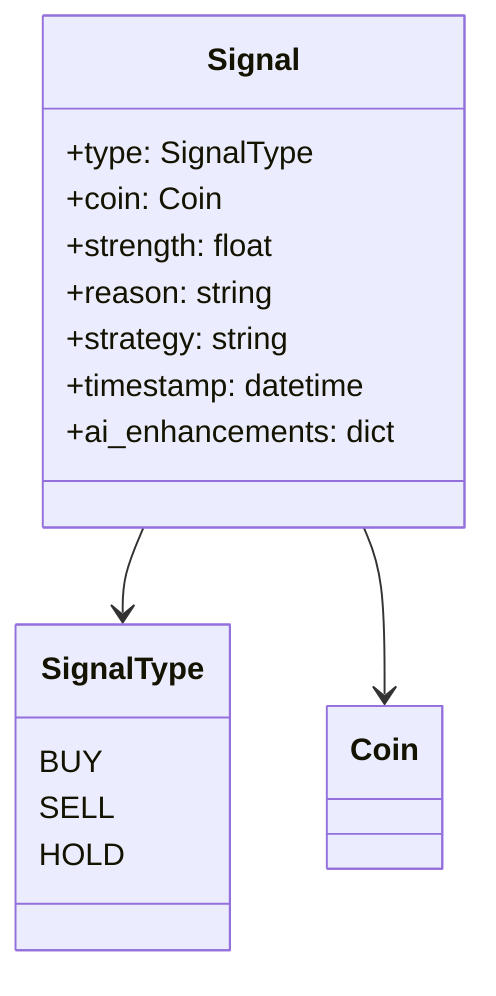
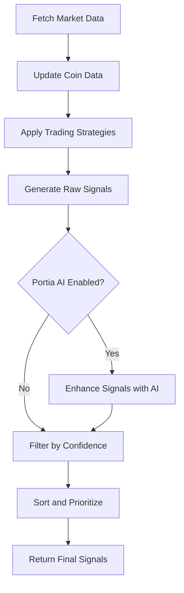
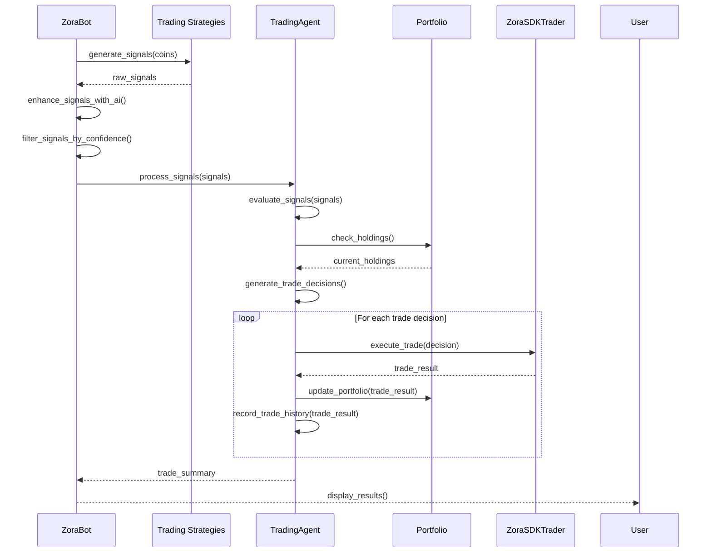

# Trading Signals System

## Overview

The trading signals system is the core decision-making component of the Zora Portia Trading Bot. It generates, processes, and acts on trading signals that indicate when to buy, sell, or hold tokens based on market conditions and analysis.

## Signal Structure

Trading signals are structured objects containing all the information needed for trading decisions:



### Signal Attributes

- **type**: The signal action (BUY, SELL, or HOLD)
- **coin**: The cryptocurrency token the signal applies to
- **strength**: Confidence level of the signal (0-1)
- **reason**: Human-readable explanation for the signal
- **strategy**: Name of the strategy that generated the signal
- **timestamp**: When the signal was generated
- **ai_enhancements**: Additional data from Portia AI (if enabled)

## Signal Generation Process

The signal generation process involves several steps:



### 1. Market Data Collection

The bot begins by collecting market data for all tracked tokens:

```python
# Update coin market data
for address in self.tracked_coins:
    coin = self.coins_by_address.get(address)
    updated_coin = await self.zora_client.update_coin_data(coin)
    self.coins_by_address[address] = updated_coin
    updated_coins.append(updated_coin)
```

### 2. Strategy Application

Each active strategy analyzes the market data and generates signals:

```python
# Generate signals from all strategies
all_signals = []
for strategy in self.strategies:
    strategy_signals = await strategy.generate_signals(updated_coins)
    all_signals.extend(strategy_signals)
```

### 3. AI Enhancement (Optional)

If Portia AI is enabled, signals are enhanced with AI insights:

```python
# Enhance signals with Portia AI
if self.portia_client and self.portia_enabled:
    enhanced_signals = await self.portia_client.enhance_signals(
        [s.to_dict() for s in all_signals]
    )
    
    # Update signal strengths and reasons based on AI insights
    for i, signal in enumerate(all_signals):
        if i < len(enhanced_signals):
            signal.strength = enhanced_signals[i].get("strength", signal.strength)
            ai_reason = enhanced_signals[i].get("ai_reason")
            if ai_reason:
                signal.reason += f" | AI: {ai_reason}"
```

### 4. Signal Filtering

Signals are filtered based on confidence threshold:

```python
# Filter signals by confidence threshold
valid_signals = [s for s in all_signals if s.strength >= self.confidence_threshold]
```

## Signal Visualization

The bot visualizes signals with color-coded output:

```
🟢 SIGNAL: BUY ZORA @ $87.45 | Confidence: 0.92 | Reason: Strong uptrend with 15.4% gain, high trading volume, extremely bullish pattern

🔴 SIGNAL: SELL GFXC @ $32.75 | Confidence: 0.85 | Reason: Bearish pattern with 8.2% drop, decreasing trading volume, support level broken

⚪ SIGNAL: HOLD ZUSD @ $1.002 | Confidence: 0.55 | Reason: Stable price with minimal volatility, monitoring for changes
```

Signal colors indicate the action type:
- 🟢 Green: BUY signal
- 🔴 Red: SELL signal
- ⚪ White: HOLD signal

## Signal Types

### BUY Signals

BUY signals indicate favorable conditions for purchasing a token. They are generated when:

- Strong positive price momentum is detected
- Technical indicators suggest an uptrend
- Volume is increasing with price
- AI analysis indicates bullish conditions (if enabled)

Example BUY signal:

```python
Signal(
    type=SignalType.BUY,
    coin=coin,
    strength=0.88,
    reason="Strong positive momentum (7.5%) with increasing volume",
    strategy="MomentumStrategy"
)
```

### SELL Signals

SELL signals suggest conditions are favorable for selling a token. They are generated when:

- Negative price momentum is detected
- Technical indicators suggest a downtrend
- Support levels are broken
- Volume is increasing with price decreases
- AI analysis indicates bearish conditions (if enabled)

Example SELL signal:

```python
Signal(
    type=SignalType.SELL,
    coin=coin,
    strength=0.82,
    reason="Negative momentum (-5.2%) with support level broken",
    strategy="TechnicalStrategy"
)
```

### HOLD Signals

HOLD signals indicate neutral conditions or insufficient data for a clear decision. They are generated when:

- Price is stable with minimal volatility
- Conflicting technical indicators
- Insufficient volume for reliable decision
- Uncertain market conditions

Example HOLD signal:

```python
Signal(
    type=SignalType.HOLD,
    coin=coin,
    strength=0.65,
    reason="Price consolidating in neutral range, awaiting breakout",
    strategy="SimpleStrategy"
)
```

## Signal Strength Calculation

Signal strength (confidence) is calculated using various factors, depending on the strategy:

```python
def _calculate_signal_strength(self, volatility: float, momentum: float, volume: float) -> float:
    """
    Calculate signal strength based on volatility, momentum, and volume
    """
    # Normalize inputs
    norm_volatility = min(1.0, volatility / (self.volatility_threshold * 2))
    norm_momentum = min(1.0, abs(momentum) / (self.momentum_threshold * 2))
    norm_volume = min(1.0, volume / (self.volume_threshold * 2))
    
    # For very low volume, reduce signal strength
    if volume < self.volume_threshold / 10:
        volume_factor = 0.5
    else:
        volume_factor = 1.0
        
    # Calculate combined strength (weighted average)
    strength = (norm_volatility * 0.3 + norm_momentum * 0.5 + norm_volume * 0.2) * volume_factor
    
    # Add some randomization for simulation purposes
    if self.simulate_price_movements:
        strength += random.uniform(-0.1, 0.1)
        
    # Ensure within 0-1 range
    return max(0.1, min(0.95, strength))
```

### Strength Categories

Signal strength is categorized into ranges:

- **Strong** (0.80-1.00): High confidence, immediate action recommended
- **Moderate** (0.60-0.79): Good confidence, action recommended
- **Weak** (0.40-0.59): Limited confidence, monitor closely
- **Very Weak** (0.00-0.39): Low confidence, insufficient data or conditions

## Signal Processing Workflow

Once signals are generated, they go through a processing workflow:



## Signal Evaluation by Trading Agent

The TradingAgent evaluates signals to decide which trades to execute:

```python
async def evaluate_signals(self, signals: List[Signal]) -> List[Dict[str, Any]]:
    """
    Evaluate signals and decide which trades to execute
    """
    if not signals:
        return []
        
    # Filter out signals that don't pass the confidence threshold
    valid_signals = [s for s in signals if s.strength >= self.confidence_threshold]
    
    if not valid_signals:
        return []
        
    # Convert signals to trade decisions
    decisions = []
    for signal in valid_signals:
        coin = signal.coin
        
        # Skip signals without price
        if coin.current_price <= 0:
            continue
            
        # Determine trade amount based on signal type
        if signal.type == SignalType.BUY:
            # Calculate available amount to buy
            available_cash = self.mock_cash_balance
            cash_to_use = min(self.max_trade_amount_usd, available_cash * 0.2)
            
            # Skip if not enough cash
            if cash_to_use <= 0:
                continue
                
            # Calculate amount of tokens to buy
            amount = cash_to_use / coin.current_price
            
            decisions.append({
                "coin": coin,
                "type": "BUY",
                "amount": amount,
                "price": coin.current_price,
                "signal_strength": signal.strength,
                "reason": signal.reason
            })
            
        elif signal.type == SignalType.SELL:
            # Get holding for this coin
            holding = self.portfolio.get_holding(coin.address)
            
            if not holding or holding.amount <= 0:
                continue
                
            # Calculate amount to sell (all if strong signal, partial if moderate)
            sell_percentage = 1.0 if signal.strength > 0.85 else 0.5
            amount = holding.amount * sell_percentage
            
            decisions.append({
                "coin": coin,
                "type": "SELL",
                "amount": amount,
                "price": coin.current_price,
                "signal_strength": signal.strength,
                "reason": signal.reason
            })
            
    return decisions
```

## Multi-Strategy Signal Handling

When multiple strategies are active, signals are combined and processed:

### Signal Deduplication

If multiple strategies generate signals for the same coin, the strongest signal is used:

```python
# Group signals by coin address
signals_by_coin = {}
for signal in all_signals:
    coin_address = signal.coin.address
    if coin_address not in signals_by_coin or signal.strength > signals_by_coin[coin_address].strength:
        signals_by_coin[coin_address] = signal

# Get the deduplicated signals
deduplicated_signals = list(signals_by_coin.values())
```

### Strategy Weighting

Some strategies can be given more weight than others:

```python
# Apply strategy weights
weighted_signals = []
for signal in all_signals:
    strategy_weight = self.strategy_weights.get(signal.strategy, 1.0)
    signal.strength *= strategy_weight
    weighted_signals.append(signal)
```

## Signal Persistence

Signals can be persisted for historical analysis:

```python
# Record signals to database or file
async def record_signals(self, signals: List[Signal]):
    """Record signals for historical analysis"""
    signal_records = []
    for signal in signals:
        record = {
            "timestamp": datetime.now().isoformat(),
            "coin_address": signal.coin.address,
            "coin_symbol": signal.coin.symbol,
            "signal_type": signal.type.value,
            "strength": signal.strength,
            "reason": signal.reason,
            "strategy": signal.strategy,
            "price": signal.coin.current_price
        }
        signal_records.append(record)
        
    # Write to JSON file
    with open("signal_history.json", "a") as f:
        for record in signal_records:
            f.write(json.dumps(record) + "\n")
```

## Signal Analysis

The bot can analyze signal performance over time:

```python
async def analyze_signal_performance(self):
    """Analyze the performance of past signals"""
    # Load signal history
    with open("signal_history.json", "r") as f:
        signal_records = [json.loads(line) for line in f]
    
    # Group by strategy
    strategies = {}
    for record in signal_records:
        strategy = record["strategy"]
        if strategy not in strategies:
            strategies[strategy] = []
        strategies[strategy].append(record)
    
    # Calculate performance metrics
    for strategy, records in strategies.items():
        # Calculate success rate
        buy_signals = [r for r in records if r["signal_type"] == "BUY"]
        successful_buys = 0
        
        for signal in buy_signals:
            # A buy signal is successful if the price increased within 24h
            current_price = self.get_current_price(signal["coin_address"])
            if current_price > signal["price"]:
                successful_buys += 1
        
        success_rate = successful_buys / len(buy_signals) if buy_signals else 0
        
        print(f"Strategy: {strategy}")
        print(f"Total signals: {len(records)}")
        print(f"Buy signals: {len(buy_signals)}")
        print(f"Success rate: {success_rate:.2%}")
        print()
```

## AI-Enhanced Signals

When Portia AI integration is enabled, signals are enhanced with additional data:

### Standard Signal
```json
{
  "type": "BUY",
  "coin": {
    "address": "0x7ce9c67c8a1d65ce61fc464727cc0f9caabf92b9",
    "symbol": "ZORA",
    "name": "Zora Token",
    "current_price": 87.45
  },
  "strength": 0.72,
  "reason": "Strong momentum with 15.4% gain",
  "strategy": "SimpleStrategy"
}
```

### AI-Enhanced Signal
```json
{
  "type": "BUY",
  "coin": {
    "address": "0x7ce9c67c8a1d65ce61fc464727cc0f9caabf92b9",
    "symbol": "ZORA",
    "name": "Zora Token",
    "current_price": 87.45
  },
  "strength": 0.85,  // Enhanced confidence
  "reason": "Strong momentum with 15.4% gain | AI: Bullish pattern forming with increasing social sentiment",
  "strategy": "SimpleStrategy",
  "ai_enhancements": {
    "sentiment_score": 0.82,
    "technical_outlook": "bullish",
    "price_target": 98.50,
    "stop_loss_suggestion": 78.70,
    "confidence_adjustment": 0.13
  }
}
```

## Signal-Based Trading

The final step is executing trades based on signals:

```python
async def execute_trades_from_signals(self, signals: List[Signal]):
    """Execute trades based on signals"""
    # Evaluate signals to get trade decisions
    trade_decisions = await self.trading_agent.evaluate_signals(signals)
    
    # Execute each trade
    executed_trades = []
    for decision in trade_decisions:
        result = await self.trading_agent.execute_trade(decision)
        if result.get("success", False):
            executed_trades.append(result)
    
    # Log trade summary
    if executed_trades:
        logger.info(f"Executed {len(executed_trades)} trades based on signals")
        for trade in executed_trades:
            coin = trade["coin"]
            trade_type = trade["type"]
            amount = trade["amount"]
            price = trade["price"]
            value = amount * price
            
            logger.info(f"Trade: {trade_type} {amount:.4f} {coin.symbol} @ ${price:.4f} | Total: ${value:.2f}")
    else:
        logger.info("No trades executed from signals")
```

## Signal Configuration

Signal generation and processing can be configured through the config.json file:

```json
{
  "signals": {
    "minimum_confidence": 0.75,
    "hold_threshold": 0.5,
    "log_all_signals": false,
    "max_signals_per_update": 10,
    "ai_enhancement": true,
    "ai_confidence_boost": 0.1,
    "persistence": {
      "enabled": true,
      "history_file": "signal_history.json"
    }
  }
}
```

## Best Practices for Signal Management

1. **Start conservative**: Begin with higher confidence thresholds (0.80+)
2. **Analyze signal performance**: Track which strategies generate the best signals
3. **Combine strategies**: Use multiple strategies for more robust signals
4. **Use AI enhancement**: Leverage Portia AI for improved signal quality
5. **Adjust based on market**: Use different thresholds for different market conditions
6. **Record signal history**: Keep track of signals for performance analysis
7. **Review signals manually**: Periodically review signals to understand patterns

## Conclusion

The trading signals system is the intelligence core of the Zora Portia Trading Bot. By generating, processing, and acting on high-quality signals, the bot makes informed trading decisions that aim to capitalize on market opportunities while minimizing risks.
