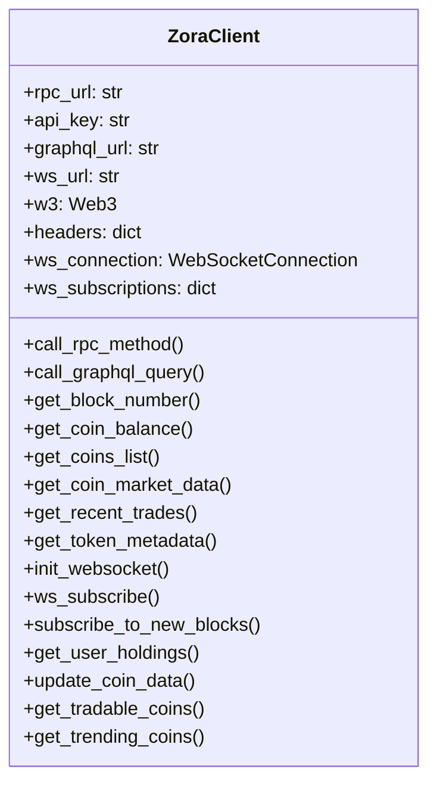
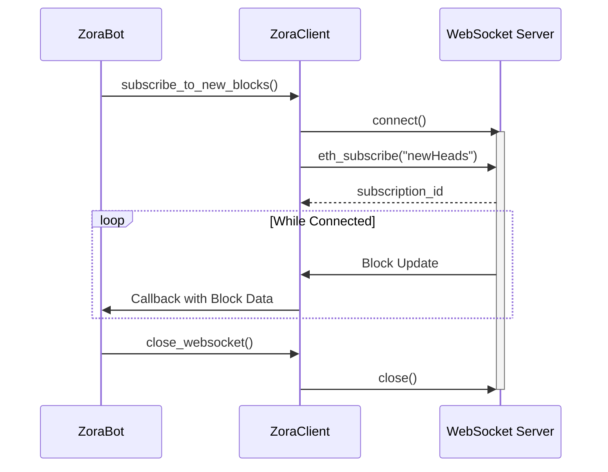

# Zora API Client

## Overview

The `ZoraClient` class provides a comprehensive interface for interacting with the Zora Network. It handles API requests, WebSocket connections, and blockchain interactions required for the trading bot to function.

## Class Diagram



## API Endpoints

The Zora API Client interacts with multiple API endpoints:

1. **Blockscout API**: `https://explorer.zora.energy/api`
   - Used for blockchain explorer data
   - Token transfers, contract data, etc.

2. **Zora SDK API**: `https://api-sdk.zora.engineering` or `https://api.zora.co`
   - Trading data, token information, etc.
   - Market data and trends

3. **RPC Endpoint**: (configurable, default: `https://rpc.zora.energy/`)
   - Direct blockchain interaction
   - Transaction execution, contract calls

4. **WebSocket Endpoint**: (configurable, default: `wss://rpc.zora.energy`)
   - Real-time data updates
   - Block notifications, price feeds

## Key Features

### Token Data Retrieval

Fetches detailed information about tokens on the Zora Network:

```python
# Get list of tradable tokens
tokens = await zora_client.get_tradable_coins(limit=50)

# Get market data for a specific token
market_data = await zora_client.get_coin_market_data("0x123...")

# Get recent trades for a token
trades = await zora_client.get_recent_trades("0x123...")
```

### User Portfolio Data

Retrieves user wallet holdings and balances:

```python
# Get user holdings
holdings = await zora_client.get_user_holdings("0xWALLET_ADDRESS")

# Get token balance for a specific user and token
balance = await zora_client.get_coin_balance("0xWALLET_ADDRESS", "0xTOKEN_ADDRESS")
```

### Real-time Data with WebSockets

Establishes WebSocket connections for real-time updates:

```python
# Initialize WebSocket
await zora_client.init_websocket()

# Subscribe to new blocks
subscription_id = await zora_client.subscribe_to_new_blocks(callback_function)
```

### Direct Blockchain Interaction

Interacts directly with the blockchain via RPC calls:

```python
# Call RPC method
result = await zora_client.call_rpc_method("eth_blockNumber")

# Call contract method
token_name = await zora_client.call_rpc_method("eth_call", [{
    "to": token_address,
    "data": "0x06fdde03"  # name() function signature
}, "latest"])
```

## Data Sources

The client uses multiple data sources in a fallback pattern:

1. **Primary Source**: Zora SDK API
2. **Secondary Source**: Blockscout API
3. **Tertiary Source**: Direct RPC calls
4. **Last Resort**: Simulated data generation

If a primary source fails, the client automatically tries the next available source.

## WebSocket Functionality

The WebSocket implementation provides real-time data updates:



## Rate Limiting Handling

The client implements exponential backoff for rate limiting:

```python
# Exponential backoff for rate limiting
max_retries = 3
base_delay = 1.0

for retry in range(max_retries + 1):
    try:
        # Make request
        if response.status == 429:  # Rate limited
            delay = base_delay * (2 ** retry)
            await asyncio.sleep(delay)
            continue
    except Exception as e:
        # Handle error
```

## Simulated Data Generation

For testing or when APIs are unavailable, the client can generate simulated data:

### Coin Price Simulation

```python
def _simulate_price_movement(self, coin: Coin) -> Coin:
    # Generate a random price change (-8% to +10%)
    change_pct = random.uniform(-0.08, 0.10)
    
    # Calculate new price
    old_price = coin.current_price
    new_price = old_price * (1 + change_pct)
    coin.current_price = max(0.00001, new_price)
    
    # Update price change percentage
    coin.price_change_24h = change_pct * 100
    
    # Adjust volume and market cap
    # ...
    
    return coin
```

### Trending Coins Simulation

When API data for trending coins isn't available, the client generates simulated coins with realistic properties:

```python
# Sample token names for simulation
token_names = [
    "ZoraCoin", "BaseToken", "MemeDAO", "AstroFinance", "MetaverseToken",
    "DeFiYield", "PixelArt", "EcoDAO", "ZoraVerse", "ChainNation"
]

# Create simulated coins
for name in token_names:
    # Generate random address, price, volume, etc.
    # Create coin object
    # Add to results list
```

## ERC-20 Contract Interaction

The client includes the ERC-20 ABI for interacting with token contracts:

```python
# ERC20 ABI for token interactions
ERC20_ABI = [
    {
        "constant": True,
        "inputs": [],
        "name": "name",
        "outputs": [{"name": "", "type": "string"}],
        "payable": False,
        "stateMutability": "view",
        "type": "function"
    },
    # Additional methods: symbol, decimals, balanceOf, allowance
]
```

## Error Handling

The client implements comprehensive error handling:

- API request failures
- WebSocket connection issues
- JSON parsing errors
- Contract call failures
- Rate limiting
- Network timeouts

Each error is logged with appropriate severity and context.

## Asynchronous Execution

The entire client is built using Python's `asyncio` for non-blocking operation:

```python
# Run Web3 functions in a non-blocking way
async def _run_async(self, func, *args, **kwargs):
    loop = asyncio.get_event_loop()
    return await loop.run_in_executor(None, lambda: func(*args, **kwargs))
```

## Example Usage

```python
# Initialize client
zora_client = ZoraClient(
    rpc_url="https://rpc.zora.energy/",
    api_key="YOUR_API_KEY",  # Optional
    ws_url="wss://rpc.zora.energy"
)

# Get trending coins
trending_coins = await zora_client.get_trending_coins(limit=10)

# Update coin data
updated_coin = await zora_client.update_coin_data(coin)

# Get user holdings
holdings = await zora_client.get_user_holdings("0xWALLET_ADDRESS")
```
