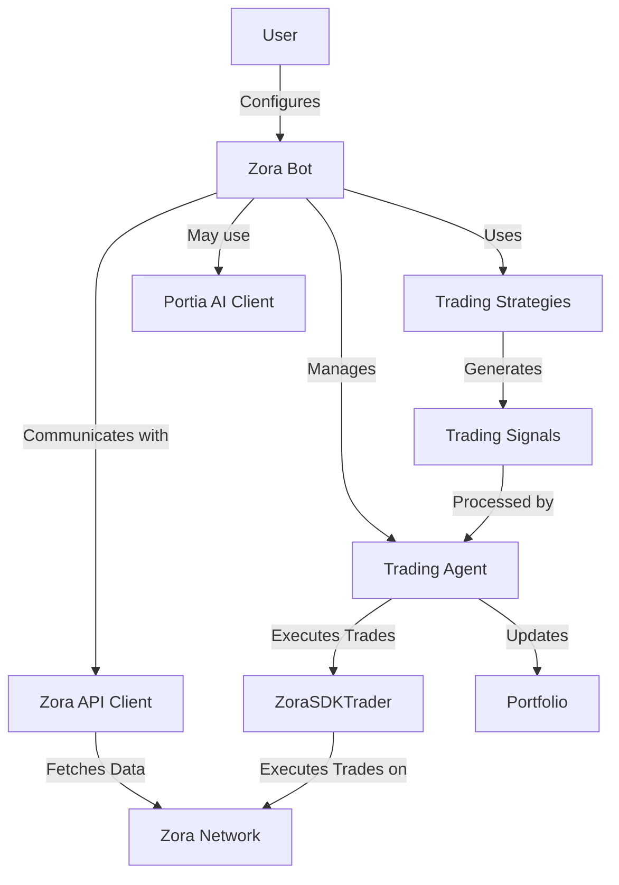

# Zora Portia Trading Bot

## Overview

The Zora Portia Trading Bot is an autonomous trading bot built for the Zora Network with Portia AI integration. It allows for both simulated and real trading of tokens on Zora Network.

## Table of Contents

- [Architecture](#architecture)
- [Features](#features)
- [Installation](#installation)
- [Usage](#usage)
- [Components](#components)
- [API Integration](#api-integration)
- [Trading Strategies](#trading-strategies)
- [Configuration](#configuration)
- [Development](#development)

## Architecture



## Features

- Automated trading on Zora Network
- Integration with Portia AI for trading insights
- Multiple trading strategies
- Real-time market data via WebSockets
- Simulated trading for testing strategies
- Portfolio tracking and management
- Customizable trading parameters
- Command-line interface for easy operation

## Installation

### Prerequisites

- Python 3.8 or higher
- Zora Network wallet with funds
- Portia AI API key (optional)

### Setup

1. Clone the repository:
   ```bash
   git clone https://github.com/yourusername/zora-portia-bot.git
   cd zora-portia-bot
   ```

2. Create a virtual environment:
   ```bash
   python -m venv .venv
   source .venv/bin/activate  # On Windows: .venv\Scripts\activate
   ```

3. Install dependencies:
   ```bash
   pip install -r requirements.txt
   ```

4. Configure the bot:
   ```bash
   cp config.example.json config.json
   # Edit config.json with your settings
   ```

5. Set up environment variables:
   ```bash
   cp .env.example .env
   # Edit .env with your API keys and wallet information
   ```

## Usage

### Basic Usage

Run the bot with default settings:

```bash
python run_bot.py --wallet YOUR_WALLET_ADDRESS
```

### Simulation Mode

Run the bot in simulation mode to test strategies without real trades:

```bash
python run_bot.py --wallet YOUR_WALLET_ADDRESS --signals-only
```

### Automated Trading

Enable automated trading with confidence threshold:

```bash
python run_bot.py --wallet YOUR_WALLET_ADDRESS --auto-trade --confidence 0.8 --max-trade-amount 50
```

### Parameters

- `--wallet`: Your wallet address for tracking/trading
- `--auto-trade`: Enable automated trading
- `--max-trade-amount`: Maximum trade amount in USD (default: 100)
- `--confidence`: Confidence threshold for executing trades (0-1, default: 0.75)
- `--mock-capital`: Mock capital for simulated trading (default: $1000)
- `--strategies`: Comma-separated list of trading strategies to use
- `--no-websocket`: Disable WebSocket connection (use polling)
- `--signals-only`: Only display signals, do not execute trades

## Components

### Core Components

1. **ZoraBot** (`src/bot.py`): Main bot class that orchestrates all components
2. **TradingAgent** (`src/trading/agent.py`): Handles trade evaluation and execution
3. **ZoraClient** (`src/api/zora.py`): API client for Zora Network
4. **Portfolio** (`src/models/portfolio.py`): Manages user portfolio
5. **Strategies** (`src/strategies/`): Trading strategy implementations

## API Integration

### Zora Network API

The bot connects to Zora Network through several API endpoints:

- REST API for market data
- WebSocket API for real-time updates
- RPC API for blockchain interactions

### Portia AI Integration

When configured with a Portia API key, the bot can leverage AI insights for trading decisions.

## Trading Strategies

### Available Strategies

1. **SimpleStrategy**: Basic strategy using momentum, volatility, and volume indicators
2. **MomentumStrategy**: Strategy focused on price momentum signals
3. **TrendFollowingStrategy**: Follows established market trends

### Custom Strategies

You can create custom strategies by implementing the strategy interface and adding them to the registry.

## Configuration

### Configuration File (config.json)

```json
{
  "zora": {
    "rpc_url": "https://rpc.zora.energy/"
  },
  "portia": {
    "api_url": "https://api.portia.ai/v1"
  },
  "max_coins": 50,
  "scan_interval": 120,
  "strategies": {
    "momentum": {
      "enabled": true
    }
  }
}
```

### Environment Variables (.env)

```
ZORA_RPC_URL=https://rpc.zora.energy/
PORTIA_API_KEY=your_portia_api_key
PORTIA_API_URL=https://api.portia.ai/v1
WALLET_PRIVATE_KEY=your_private_key_for_real_trading
```

## Development

### Project Structure

```
zora-portia-bot/
├── src/
│   ├── api/
│   │   ├── zora.py
│   │   └── portia.py
│   ├── models/
│   │   ├── coin.py
│   │   ├── portfolio.py
│   │   └── signal.py
│   ├── strategies/
│   │   ├── registry.py
│   │   ├── simple.py
│   │   └── momentum.py
│   ├── trading/
│   │   ├── agent.py
│   │   └── zora_trader.py
│   ├── utils/
│   │   └── logging.py
│   ├── bot.py
│   └── config.py
├── tests/
├── .env
├── config.json
├── requirements.txt
├── run_bot.py
└── README.md
```

### Adding New Strategies

1. Create a new file in `src/strategies/`
2. Implement the strategy interface
3. Add the strategy to the registry in `src/strategies/registry.py`
4. Use the strategy with `--strategies` parameter

### Testing

Run tests with:

```bash
pytest tests/
```

## Disclaimer

This bot is provided for educational and research purposes only. Use at your own risk. Trading cryptocurrencies involves significant risk and you should never trade with money you cannot afford to lose.
